# Recording Studio Tycoon
*A tactile music industry simulation game built with React, PixiJS, Tone.js, TypeScript, and modern web technologies.*

> [!IMPORTANT]
> **Proprietary source — not open source.** Recording Studio Tycoon and its original code, game design, text, artwork, audio, data, and documentation are all rights reserved. Public availability on GitHub does not grant permission to copy, redistribute, commercialise, or build another game from RST. Third-party components remain under their own licences. See [LICENSE](./LICENSE) and [THIRD_PARTY_NOTICES.md](./THIRD_PARTY_NOTICES.md).

---

## 🎯 Project Overview

**Recording Studio Tycoon** is an immersive music industry simulation game: build and manage a legendary recording studio from the 1960s analog tape era through to modern digital streaming. Hire specialized engineers and session musicians, invest in vintage and cutting-edge hardware, pitch for record label contracts, master interactive production minigames, and settle hit records to top the industry charts.

- **Current Version:** 0.5.0 (The Living Studio & Campaign Expansion)
- **Development Status:** Active Development
- **Last Updated:** October 4, 2026
- **Live Shell:** `src/pages/Index.tsx` mounts the game. The main viewport features an interactive isometric PixiJS studio floor (`src/components/StudioRoom.tsx` / `src/components/WebGLCanvas.tsx`) with clickable hotspots, contextual slide-over management drawers, tactile hardware controls, era props, a trophy wall, and the current session state.

---

## 🆕 What&apos;s New in v0.5.0

The latest milestone expands the tactile studio loop into a broader campaign:

- **Bus & Stem Merge:** Route tracks through buses and stems in a 2048-style mixing puzzle while managing headroom and move limits.
- **Campaign & Lore:** Follow rival studios, story contracts, 13 era-gated subplots, decision popups, a chronicle, 25 achievements, and multiple endings.
- **Producer Origins:** Start each career with a distinct background and gameplay perk.
- **Era-Authentic Gigs:** Choose contracts across the 1960s, 1980s, 2000s, and 2020s with risk/reward stakes.
- **Warm Flat UI:** A unified visual language now spans the HUD, drawers, popups, toasts, and minigames.
- **Keyboard Shortcuts:** Use `1–5` for dock tabs and `?` to open the shortcut overlay.

## 📸 Current Build (October 2026)

Screenshots captured from the current `main` build (1980s Golden Age start).

| Splash | Era Selection |
| :---: | :---: |
| 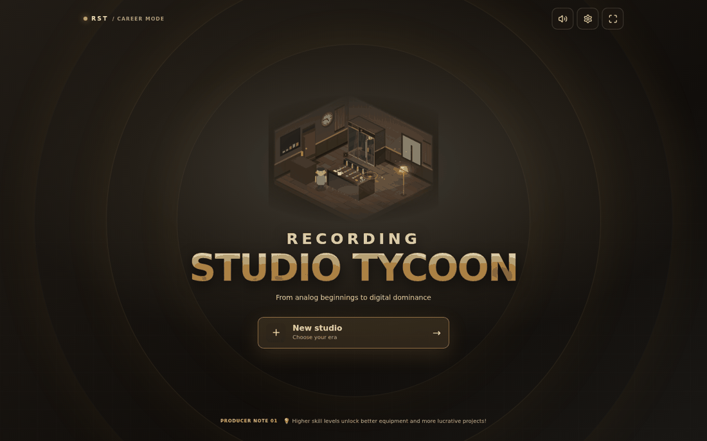 | 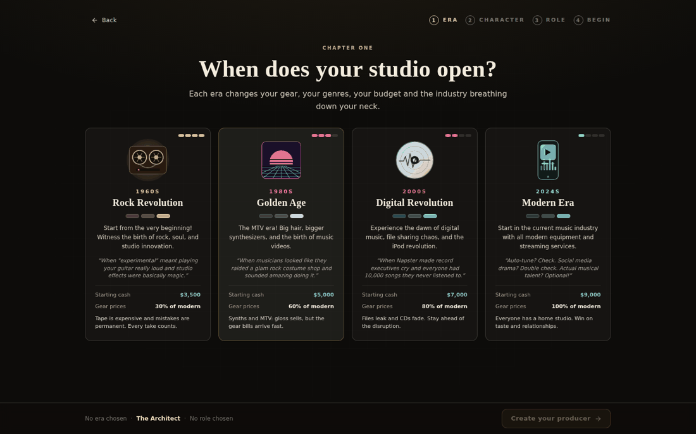 |
| *Isometric studio vignette, vinyl-groove backdrop and one-tap new career.* | *Pick an era, then build your producer and choose a role.* |

| Living Studio Floor | Booking Sessions |
| :---: | :---: |
| 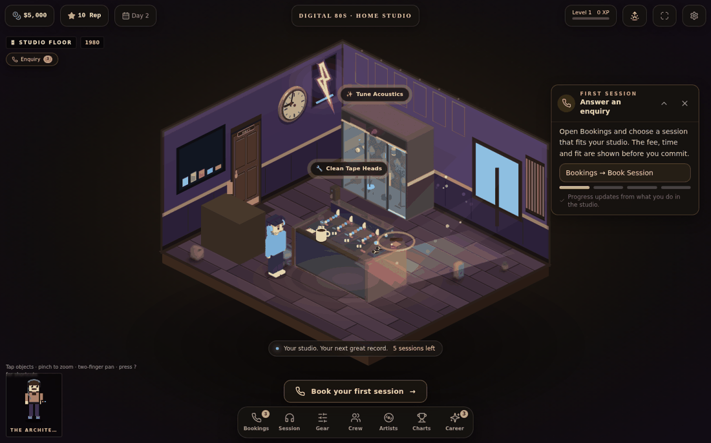 | 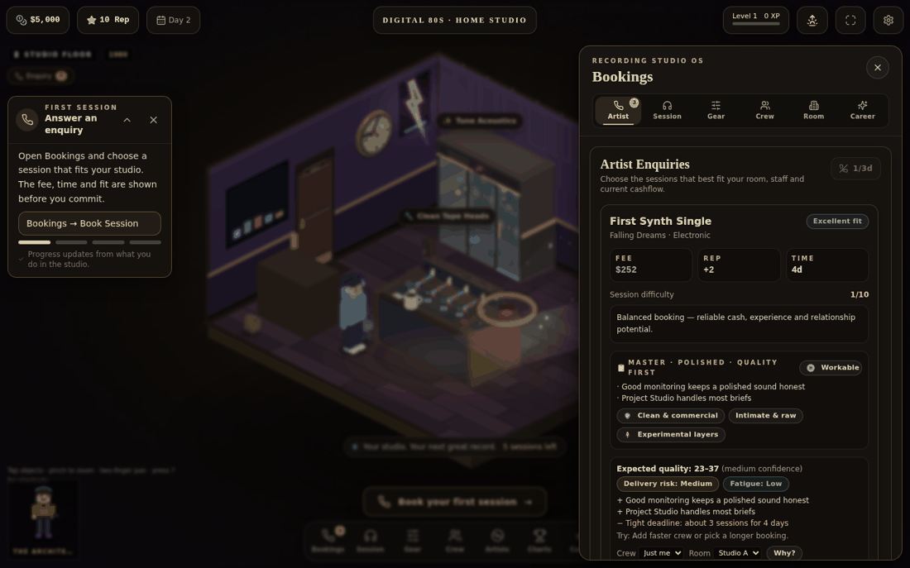 |
| *Isometric PixiJS studio with era decor, hotspots, first-session guide and bottom dock.* | *Artist enquiries with fit, risk (Safe / Ambitious / Moonshot) and payout shown before you commit.* |

| At the Console | Industry Charts |
| :---: | :---: |
| 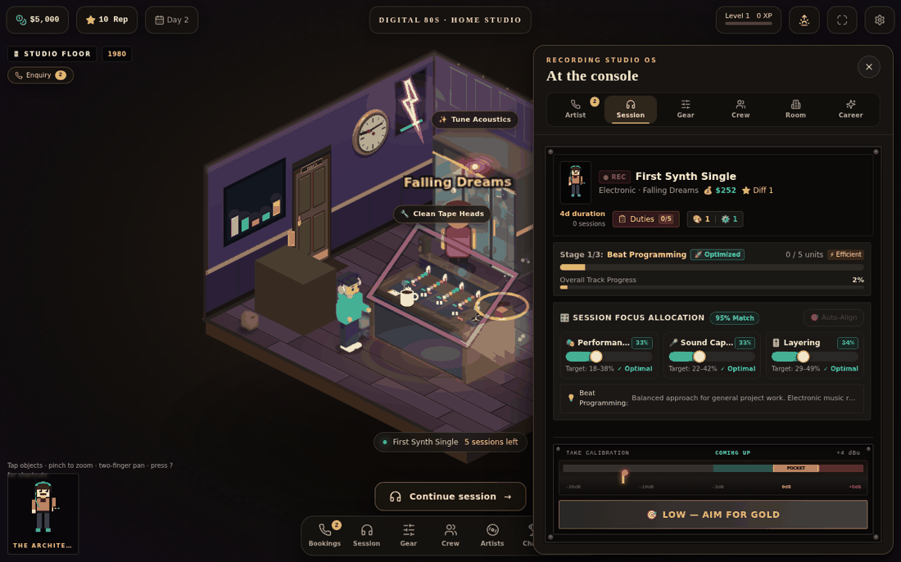 | 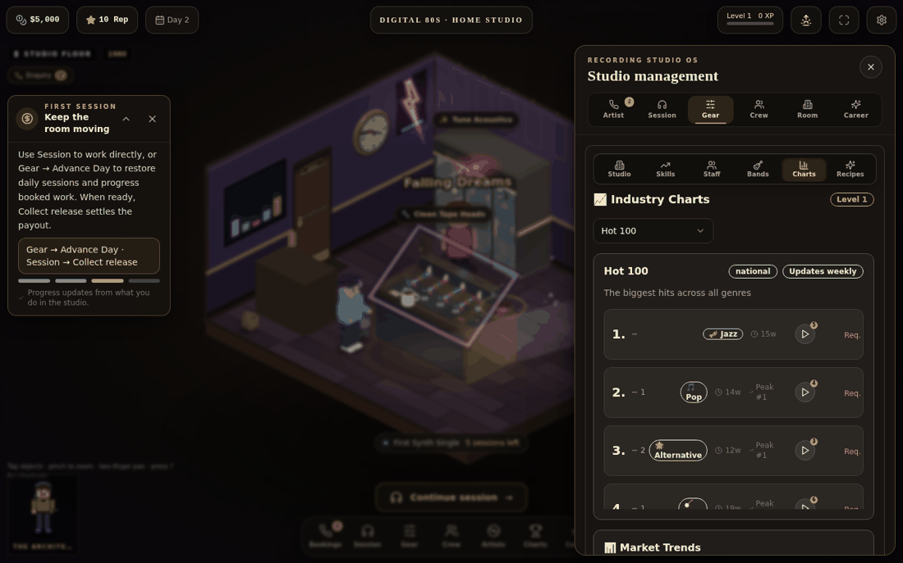 |
| *Focus allocation, stage progress and the analog take-calibration meter.* | *Hot 100 and market trends in the management drawer.* |

---

## 📸 Evolution & Visual Progression (Before & After)

Rather than erasing earlier versions, Recording Studio Tycoon showcases its visual and mechanical evolution from early prototypes to the current tactile living studio.

### 1. Studio Floor Evolution
*From an empty central placeholder box to a fully interactive isometric 3D PixiJS studio floor with physical tier-specific console progression, analog tape reels, and animated producer.*

| Before (v0.2.0 Desktop-Idle) | After (v0.4.0 Living Isometric Studio) |
| :---: | :---: |
|  | 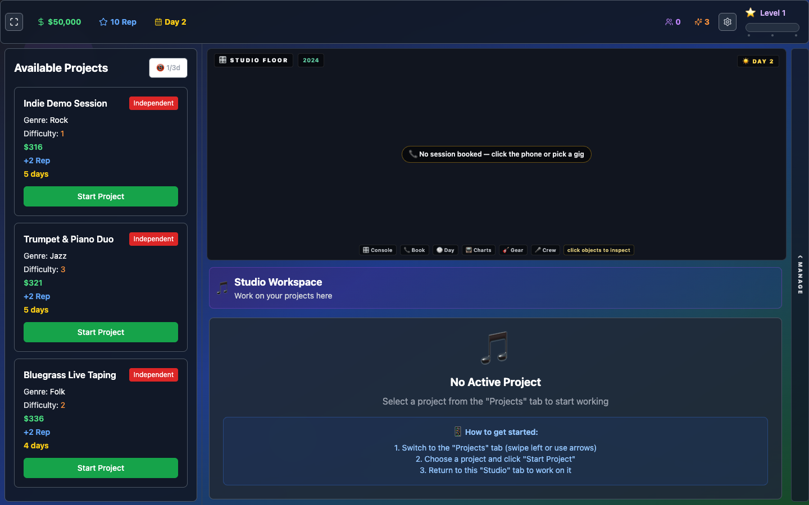 |
| *Static central box with generic action buttons and blank room canvas.* | *True isometric 3D PixiJS floor with Tier 1 valve console, reel-to-reel tape deck, Auratone cube, engineer character, and ambient lighting.* |

---

### 2. Studio Management & Navigation Evolution
*From rigid, screen-filling 3-column dashboards to a living studio world with contextual slide-over drawers.*

| Before (v0.1.0 Fixed 3-Column Dashboard) | After (v0.4.0 Contextual Slide-Over Drawer) |
| :---: | :---: |
| 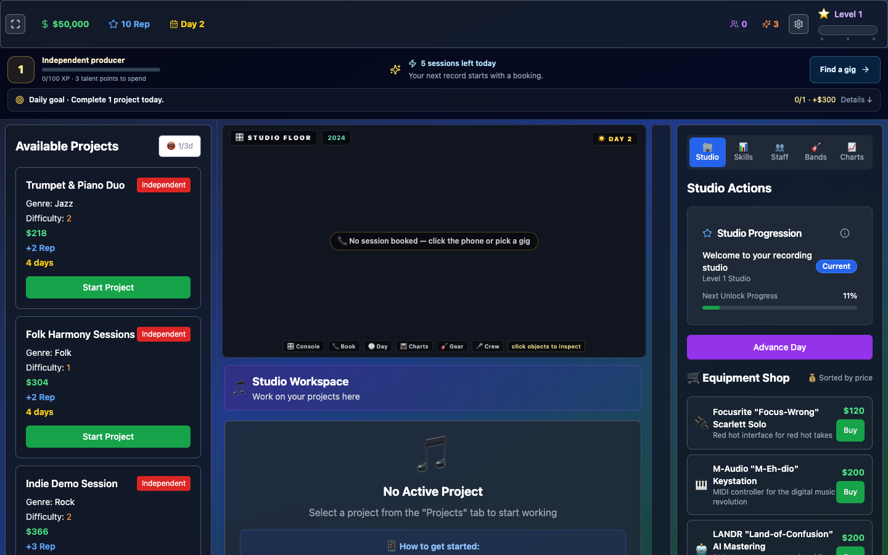 |  |
| *Fixed multi-column layout crowding the viewport with text-heavy tables.* | *Clean slide-over drawer highlighting Artist Enquiries, genre compatibility badges, payout forecasts, and glowing action prompts.* |

---

### 3. Splash Screen & Era Selection Evolution
*From a minimal alpha dialog to a retro vinyl groove experience with hardware switches and historical era selection.*

| Before (v0.3.1 Alpha Splash) | After (v0.4.0 Vinyl Grooves & Era Starters) |
| :---: | :---: |
| 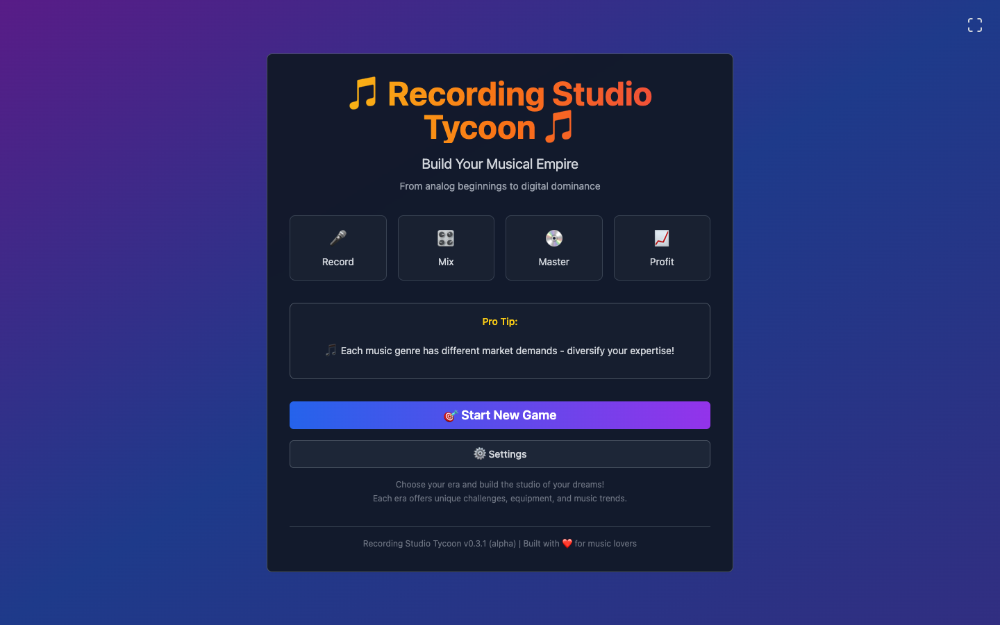 | 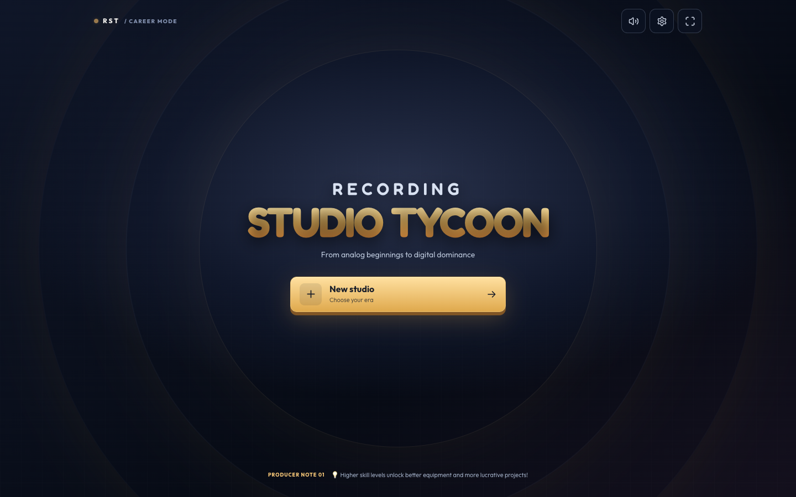 |
| *Flat card dialog on purple gradient background.* | *Concentric vinyl-groove backdrop, embossed gold branding, hardware audio toggles, and multi-era career selection.* |

---

### 4. Interactive Console & Hardware Work Loop
*The heart of the studio: tactile analog take recording, timing accuracy, and variable energy progression.*

| At the Console (Work Loop) | Era Progression & Historical Gigs |
| :---: | :---: |
| 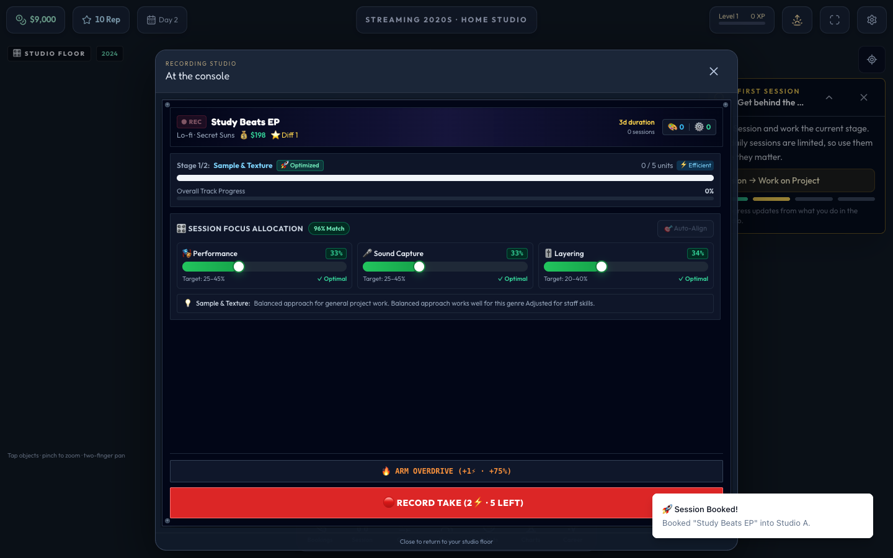 | 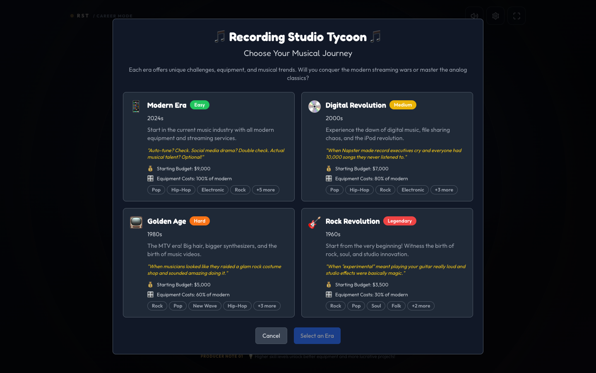 |
| *Dynamic 60fps Lock Take button, analog PocketMeter timing gauge, focus sliders, and Overdrive.* | *Select between 1960s Rock Revolution, 1980s Golden Age, 2000s Digital Revolution, or 2020s Modern Streaming.* |

---

### 5. Historical Foundation (2025 Archive)
*The original prototype foundation from June 2025, showing the initial conception of project focus allocation and equipment shopping.*

<p align="center">
  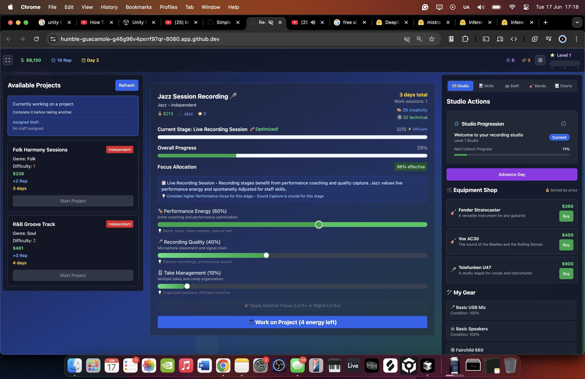
  <br />
  <em>Original June 2025 prototype: 3-column layout featuring early focus sliders and equipment catalog.</em>
</p>

---

## 🕹️ Core Game Mechanics & Systems

### 🎛️ 1. Living Isometric Studio & Tier Progression (`WebGLCanvas.tsx`)
- **True Isometric Projection:** Rendered using PixiJS 8 on an isometric grid (`TILE_W=56, TILE_H=28`) with z-ordering, dynamic shadows, and era-tinted color grading (`EraGrade`).
- **Tier-Specific Hardware Progression:**
  - **Tier 1 (Home Studio):** 4-channel vintage valve desk with mahogany wood cheeks, analog VU meters, Auratone 5C mono cube monitor, and twin-spool reel-to-reel tape deck.
  - **Tier 2 (Bedroom+):** Sleek slate console, Yamaha NS-10 studio monitors, analog phone, and compact rack unit.
  - **Tier 3 (Project Studio):** British racing-blue console, single DAW display, dual stereo monitors, and 2-unit outboard rack.
  - **Tier 4 (Studio A):** Dark graphite professional console with illuminated meter bridge, dual DAW displays, and 4-unit outboard gear bay.
  - **Tier 5 (Hit Factory):** World-class gold-trimmed flagship console, dual ultra-wide displays, master patchbay, and full multi-rack outboard suite.
- **Interactive Hotspots:** Clickable console, live room, analog telephone (with pulsing alert ring), wall clock, CRT monitor, and gear shelf.

### ⏱️ 2. Interactive Console Work Loop & PocketMeter (`PocketMeter.tsx`)
- **Dynamic Lock Take Transport:** 60fps illuminated transport button with haptic press animations and stateful feedback.
- **Analog PocketMeter Gauge:** Real-time timing window tracking take precision — evaluates needle position to award **Gold Takes** (perfect pocket), **Silver Takes**, or **Solid Takes**.
- **Variable Energy Take Progression:** Spend 1⚡ (efficient take), 2⚡ (standard production take), or trigger **Overdrive (+1⚡ / 3⚡ total)** for a +75% production boost with higher reward potential.
- **Genre Chord Synthesis (Tone.js):** Generates authentic musical chords (Rock, Pop, Hip-Hop, Electronic, Jazz) using browser Web Audio synthesis immediately upon locking in a take.

### 🔊 3. Tactile Audio System & Kenney UI Assets (`audioSystem.ts`)
- **Analog UI SFX:** Authentic mechanical switch clicks, fader slides, and rotary knob snaps sourced from the Kenney audio asset library.
- **Audio Context Unlock:** Graceful user-gesture unlocking wired to the global audio signal, ensuring seamless background sound and synthesizer playback across all modern browsers.
- **Juice & Celebration:** Particle confetti bursts (`canvas-confetti`) and Golden Reels celebrations trigger on platinum releases, awards, and milestone achievements.

### 🏆 4. Fun-First RPG Progression Overhaul
- **Take Evaluation Engine (`takeEvaluation.ts`):** Translates timing accuracy and focus into performance quality scores.
- **Combo Codex (`comboCodex.ts`):** Rewarding consecutive successful takes with multiplying quality bonuses.
- **Contract Stakes (`contractStakes.ts`):** Choose between **Safe Contracts** (steady guaranteed payouts) and **Moonshot Stakes** (up to 1.6x massive payouts and reputation gains, with harsh penalties on missed deadlines).
- **Stage Grades (`stageGrades.ts`):** Letter grading (S/A/B/C) per production stage (Tracking, Overdubs, Mixing, Mastering) with clear feedback on where the session excelled.
- **Character Origins & Lore (`characterOrigins.ts`, `studioLore.ts`):** 5 distinct producer origins with tailored starting perks, console laws, rival studios, and narrative dilemmas.

### 🧩 5. Studio Synergies System (`synergyCatalog.ts`)
- **20 Authored Synergies:** Unlocks special multiplicative bonuses when pairing complementary rooms, equipment, staff specialties, and artist genres (e.g., *Vocal Chain* = Vocal Suite + Tube Mic + Producer).
- **Discovery Encyclopedia:** Interactive synergy catalog that tracks discovered combinations and guides strategic studio expansion.

### 🔄 6. Desktop-Idle Simulation Core (`simulationClock.ts`)
- **Active & Passive Sessions:** Sessions progress automatically in 5-minute time slices during active play or via offline catch-up (capped at 8 hours).
- **Welcome Back Modal:** Summarizes offline progress, completed stages, revenue earned, and staff energy.
- **Deterministic Seeded RNG (`seededRandom.ts`):** Mulberry32 deterministic random number generator ensures reproducible review outcomes, gig generation, and intervention triggers.

### 🎮 7. Gamepad Controller Support (`gamepadService.ts`)
- **Hardware Auto-Detection:** Plug-and-play controller detection with 60fps polling loop and haptic actuator rumble support.
- **Dynamic Button Glyphs:** SVG gamepad glyphs adapting dynamically to Xbox, PlayStation, Nintendo Switch, and Steam Deck layouts.
- **Spatial Focus Navigation:** Complete controller navigation across studio tabs, transport controls, and minigames.

---

## 💻 Tech Stack & Architecture

- **Frontend Framework:** React 19 with TypeScript 5
- **Build Tool:** Vite 5 with hot module replacement (HMR)
- **2D Canvas Rendering:** PixiJS 8 (`pixi.js` + `@pixi/react`)
- **Audio Engine:** Tone.js + Web Audio API + Kenney Tactile SFX
- **Visual Juice & Effects:** Canvas Confetti + Framer Motion 12
- **Styling:** Tailwind CSS + Radix UI / shadcn primitives
- **Icons:** Lucide React
- **Package Manager:** pnpm 12 (`devEngines` enforced)
- **Task Tracking:** Beads (`.beads/`) + GitHub Issues

---

## 🚀 Quick Start

### Prerequisites
- Node.js 18+ and pnpm 12+ (install via [pnpm.io](https://pnpm.io/) or `corepack enable`)

### Local Development
```bash
# Clone the repository
git clone https://github.com/sp80808/recording-studio-tycoon.git
cd recording-studio-tycoon

# Install dependencies (strictly managed with pnpm)
pnpm install

# Start the Vite development server
pnpm run dev
```

### Verification & Automated Testing
```bash
# Run the complete test suite (synergies, daily challenges, lore, balance harness)
pnpm test

# Run build verification (TypeScript + Vite production bundle)
pnpm run build
```

---

## 📚 Project Documentation

- **[Current Development Status](./docs/current/CURRENT_STATUS.md)** - Active development phase, completed modules, and priorities
- **[Development Progress & Changelog](./docs/progress.md)** - Comprehensive version changelog from v0.1.0 through the current v0.5.0 milestone
- **[Release Changelog](./CHANGELOG.md)** - Concise release notes for the latest versions
- **[Quick Start Guide](./docs/QUICK_START.md)** - Detailed local environment setup
- **[Troubleshooting Guide](./docs/TROUBLESHOOTING.md)** - Common development questions and fixes
- **[Feature Specifications](./docs/features/)** - Deep dives into simulation and RPG subsystems

---

## 📋 Task & Issue Tracking (Beads)

This repository uses [beads](https://github.com/beads-project/beads) for local-first, distributed issue tracking:

```bash
# View available ready tasks
bd ready

# Inspect a task details
bd show <issue-id>

# Claim an active task
bd update <issue-id> --claim

# Close a completed task
bd close <issue-id> -r "Resolution summary"
```

---

## 🔒 Licence

Recording Studio Tycoon is **proprietary source-available software, not open source**. No licence is granted to copy, redistribute, modify, commercialise, or create derivative games from RST original material except by explicit written permission or where applicable law independently permits it. GitHub's own limited public-repository rights still apply, and separately licensed third-party material remains under its upstream licence.

See [LICENSE](./LICENSE), [THIRD_PARTY_NOTICES.md](./THIRD_PARTY_NOTICES.md), and [assets/provenance.json](./assets/provenance.json).

---

*Recording Studio Tycoon — From analog beginnings to digital dominance.*
