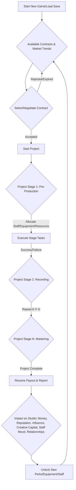
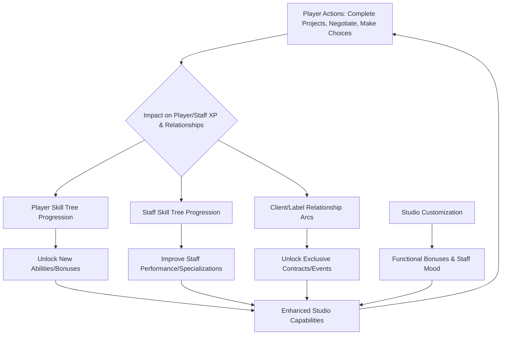

# Recording Studio Tycoon - Game Enhancement Design Plan

This plan outlines design concepts and high-level strategies across four key areas, focusing on conceptualization without delving into technical implementation details.

---

## 1. Enhance Core Gameplay Mechanics for Deeper Engagement and Strategic Depth

**Current State Analysis:**
The `ProjectService.ts` indicates a basic project progression with `workUnitsCompleted` and `stages`. `market-trends.ts` introduces dynamic genre popularity, and `advanced-contracts.ts` lays the groundwork for contract negotiation.

**Proposed Design Concepts:**

*   **Multi-Stage Project Complexity with Dynamic Challenges:**
    *   **Concept:** Projects are no longer linear progress bars. Each stage (e.g., Pre-Production, Recording, Mixing, Mastering) will have unique requirements, potential roadblocks, and mini-objectives.
    *   **Strategic Depth:** Players must allocate specific staff, equipment, and resources to each stage. Success in one stage can grant bonuses to the next, while failure can incur penalties (e.g., increased time, reduced quality, staff morale hit).
    *   **Integration:**
        *   `ProjectService.ts`: Extend `Project` and `ProjectStage` interfaces to include specific resource requirements (e.g., "Acoustic Treatment Quality," "Engineer Skill Level"), success/failure conditions, and branching paths.
        *   `market-trends.ts`: Project success/failure could have a more nuanced impact on market trends, not just based on genre but also on the quality of production.
        *   `advanced-contracts.ts`: Contracts could specify minimum quality for each stage, or offer bonuses for exceeding expectations in specific stages.

*   **Resource Management Expansion: Beyond Money:**
    *   **Concept:** Introduce "Influence" (gained from successful projects, good relationships) and "Creative Capital" (generated by highly skilled/happy staff, successful experimentation).
    *   **Strategic Depth:**
        *   **Influence:** Used to unlock exclusive contracts, attract high-profile artists, mitigate negative random events, or gain favors from record labels.
        *   **Creative Capital:** Spent on research & development (unlocking new equipment, studio perks), staff training, or unique project "boosts" (e.g., a "Breakthrough Idea" that guarantees a quality boost).
    *   **Integration:**
        *   `GameState`: Add `influence` and `creativeCapital` properties.
        *   `relationship-management.ts`: Successful projects and positive interactions increase Influence.
        *   `staff-wellbeing.ts`: High staff mood and skill levels contribute to Creative Capital generation.
        *   `studio-perks.ts`: Some perks could require or enhance Creative Capital generation/spending.

*   **Dynamic Contract Negotiation with Risk/Reward:**
    *   **Concept:** Expand `advanced-contracts.ts` to include more negotiation points (e.g., "Creative Control," "Marketing Budget," "Exclusive Rights"). Each negotiation point has a hidden "client tolerance" range.
    *   **Strategic Depth:** Players can push for better terms (higher budget, more royalties) but risk alienating the client or losing the contract. Accepting riskier contracts (tight deadlines, low creative freedom) could offer higher rewards if successful.
    *   **Integration:**
        *   `advanced-contracts.ts`: Enhance `ContractNegotiationOffer` with more complex client AI for counter-offers and dynamic `clientMin`/`clientMax` based on relationship score and market trends.
        *   `relationship-management.ts`: Negotiation outcomes directly impact client relationship scores.
        *   `random-events.ts`: Random events could introduce unexpected negotiation challenges or opportunities (e.g., a client suddenly needs a project rushed, offering a huge bonus).

**Mermaid Diagram: Enhanced Core Gameplay Loop**



---

## 2. Optimize UI/UX for Intuitive Navigation, Visual Clarity, and Seamless Interaction

**Current State Analysis:**
The `src/components/` directory shows a modular component structure, including `GameHeader.tsx`, `RightPanel.tsx`, `ProjectList.tsx`, and various modals. This provides a good foundation for UI enhancements.

**Proposed Design Concepts:**

*   **Contextual Information Overlays & Tooltips:**
    *   **Concept:** Implement rich, dynamic tooltips and overlays that appear on hover or click, providing detailed information about game elements (staff stats, equipment effects, market trends, project requirements).
    *   **Visual Clarity:** Use clear iconography, color-coding, and concise text. For example, hovering over a staff member shows their current mood, burnout, and recent mood factors (from `staff-wellbeing.ts`).
    *   **Seamless Interaction:** Allow players to "pin" important information panels to keep them visible while managing other aspects of the studio.
    *   **Integration:**
        *   `src/components/ui/tooltip.tsx`: Enhance existing tooltip component for richer content.
        *   `src/components/`: Update components like `StaffCard`, `EquipmentList`, `ProjectCard` to leverage these enhanced tooltips.
        *   `src/game-mechanics/`: Services like `StaffWellbeingService`, `MarketService` would provide the data for these tooltips.

*   **Streamlined Project & Staff Management Dashboards:**
    *   **Concept:** Create a centralized, customizable dashboard where players can quickly view active projects, assign staff, monitor progress, and address immediate issues.
    *   **Intuitive Navigation:** Use drag-and-drop interfaces for assigning staff to projects/tasks. Visual indicators (e.g., color-coded progress bars, warning icons for low mood/burnout) for quick assessment.
    *   **Integration:**
        *   `src/components/MultiProjectDashboard.tsx`: Enhance this component to be the central hub.
        *   `src/components/ActiveProject.tsx`, `src/components/ProjectCard.tsx`: Integrate more visual feedback directly into project cards.
        *   `src/hooks/useMultiProjectManagement.tsx`, `src/hooks/useStaffWellbeing.ts`: Provide the necessary data for the dashboard.

*   **Animated Feedback & Visual Cues for Game Events:**
    *   **Concept:** Use subtle animations, particle effects, and sound cues to provide immediate feedback for significant game events (e.g., project completion, staff leveling up, market shifts, random events).
    *   **Visual Clarity & Seamless Interaction:** A small "XP orb" animation (similar to `FloatingXPOrb.tsx`) could fly from a completed project to the player's XP bar. A subtle "wave" animation could emanate from the market trends panel when a significant shift occurs.
    *   **Integration:**
        *   `src/components/NotificationSystem.tsx`: Expand to handle more visual and auditory notifications.
        *   `src/utils/audioSystem.ts`: Integrate new sound effects for various events.
        *   `src/game-mechanics/random-events.ts`: Trigger specific UI animations/sounds when events occur.

---

## 3. Enrich RPG Elements with Meaningful Progression, Impactful Choices, and Robust Customization

**Current State Analysis:**
`staff-wellbeing.ts` and `relationship-management.ts` provide a foundation for staff and client dynamics. `studio-perks.ts` introduces studio-wide upgrades.

**Proposed Design Concepts:**

*   **Player & Staff Skill Trees with Specializations:**
    *   **Concept:** Beyond simple XP, introduce skill trees for the player character and individual staff members. Each skill point investment offers meaningful choices (e.g., specializing in a genre, mastering a specific production technique, improving negotiation skills).
    *   **Impactful Choices:** Unlocking higher-tier skills might require prerequisite skills, specific equipment, or even successful completion of certain project types. This creates distinct "builds" for the player and their staff.
    *   **Integration:**
        *   New data structures for skill trees (e.g., `src/data/skillTrees.ts`).
        *   `src/hooks/usePlayerProgression.tsx`: Extend to manage player skill points and choices.
        *   `staff-wellbeing.ts`: Staff skills directly influence their performance in project stages and their potential for burnout/mood changes.
        *   `studio-perks.ts`: Some studio perks could unlock new branches in staff skill trees or provide global bonuses to skill gain.

*   **Dynamic Relationship Arcs with Narrative Choices:**
    *   **Concept:** Relationships with clients and labels (from `relationship-management.ts`) evolve over time, influenced by project outcomes, negotiation success, and player choices during random events.
    *   **Impactful Choices:** Introduce dialogue options or decision points during interactions that have long-term consequences on relationships, unlocking unique contracts, or even triggering rivalries.
    *   **Integration:**
        *   `relationship-management.ts`: Enhance `Client` and `RecordLabel` interfaces to include "relationship stages" (e.g., "Acquaintance," "Trusted Partner," "Rival") that unlock specific dialogue or contract types.
        *   `random-events.ts`: Design specific random events that are triggered by relationship levels and offer choices impacting those relationships.
        *   New UI components for dialogue choices and relationship status displays.

*   **Modular Studio Customization & Environmental Impact:**
    *   **Concept:** Allow players to customize their studio layout, room types (e.g., vocal booth, live room, mixing suite), and aesthetic elements. Each customization has a functional impact.
    *   **Robust Customization:** Different room types and acoustic treatments (e.g., from `AcousticTreatmentGame.tsx`) could provide bonuses to specific project stages or genre productions. Aesthetic items could boost staff mood or client impressions.
    *   **Integration:**
        *   New data structures for studio modules and cosmetic items.
        *   `src/game-mechanics/studio-perks.ts`: Some perks could be tied to specific studio layouts or equipment configurations.
        *   `src/components/WebGLCanvas.tsx`: Potentially integrate 3D studio visualization for customization.
        *   `staff-wellbeing.ts`: Environmental factors (e.g., "Comfortable Lounge," "Inspiring Decor") could be added as mood modifiers.

**Mermaid Diagram: RPG Elements & Progression**



---

## 4. Integrate Dynamic, Context-Sensitive Minigame Triggers that Organically Complement the Primary Gameplay Loop

**Current State Analysis:**
The `src/components/minigames/` directory already contains a variety of minigames (e.g., `MixingBoardGame.tsx`, `VocalRecordingGame.tsx`, `BeatMakingGame.tsx`). This is an excellent starting point.

**Proposed Design Concepts:**

*   **Project Stage-Specific Minigame Triggers:**
    *   **Concept:** Minigames are not random pop-ups but are directly tied to the current stage of a project. For example, during the "Recording" stage, a `VocalRecordingGame.tsx` or `RhythmTimingGame.tsx` might trigger. During "Mixing," a `MixingBoardGame.tsx` or `EffectChainGame.tsx` could appear.
    *   **Organic Complement:** Success in the minigame directly impacts the quality of that specific project stage, influencing the overall project quality score and potentially unlocking bonuses. Failure could lead to quality penalties or require re-doing the stage.
    *   **Integration:**
        *   `ProjectService.ts`: Modify `updateProjects` or add a new `handleProjectStage` method to check for minigame triggers based on the current stage.
        *   `src/components/minigames/MinigameManager.tsx`: Centralize the logic for triggering and managing minigames, passing relevant project context.
        *   Minigame results (e.g., score) feed back into the `ProjectService` to adjust `overallQualityScore` or `skillBreakdown`.

*   **Staff Skill & Equipment-Driven Minigame Opportunities:**
    *   **Concept:** Certain minigames could be triggered by specific staff skills or the use of advanced equipment. For instance, a highly skilled mastering engineer might unlock a `MasteringGame.tsx` that offers a significant quality boost if played successfully. Using a new, complex piece of equipment might trigger a `GearMaintenanceGame.tsx` or `EffectChainGame.tsx` tutorial/challenge.
    *   **Organic Complement:** This encourages players to invest in staff training and equipment upgrades, as these investments directly lead to new interactive gameplay opportunities and potential rewards.
    *   **Integration:**
        *   `staff-wellbeing.ts`: Staff skill levels could be a trigger condition.
        *   `src/data/equipment.ts`: Equipment data could include a `triggersMinigame` property.
        *   `studio-perks.ts`: Some perks could unlock "mastery minigames" for specific production areas.

*   **Random Event & Relationship-Triggered Minigames:**
    *   **Concept:** `random-events.ts` could include events that trigger minigames. For example, an "Artist Collaboration" event might trigger a `SongwritingGame.tsx` or `LyricFocusGame.tsx` to impress a new artist. A "Studio Emergency" event could trigger a `GearMaintenanceGame.tsx` to quickly fix broken equipment.
    *   **Organic Complement:** These minigames would feel like natural responses to dynamic game situations, adding urgency and consequence to the player's actions.
    *   **Integration:**
        *   `random-events.ts`: Add a new `minigameTrigger` property to `RandomEvent` interface, specifying which minigame to launch and what parameters to pass.
        *   `relationship-management.ts`: Successful completion of relationship-triggered minigames could significantly boost relationship scores.

**Mermaid Diagram: Minigame Integration**

```mermaid
graph TD
    A[Core Gameplay Loop: Project Progression] --> B{Project Stage Reached?};
    B -- Yes --> C{Check for Stage-Specific Minigame Trigger};
    C -- Triggered --> D[Launch Minigame (e.g., Mixing, Vocal Recording)];
    D -- Minigame Result (Score/Success) --> E[Apply Impact to Project Quality/Time];
    E --> A;
    F[Player Actions: Staff Training, Equipment Purchase] --> G{New Skill/Equipment Unlocked?};
    G -- Yes --> H{Check for Skill/Equipment Minigame Trigger};
    H -- Triggered --> D;
    I[Random Event Occurs] --> J{Event Triggers Minigame?};
    J -- Yes --> D;
```

---

**Summary of Design Plan:**

The design plan focuses on deepening the "Recording Studio Tycoon" experience by:

1.  **Enhancing Core Gameplay:** Introducing multi-stage project complexity with dynamic challenges, expanding resource management beyond money to include "Influence" and "Creative Capital," and implementing a more nuanced contract negotiation system with risk/reward elements.
2.  **Optimizing UI/UX:** Developing contextual information overlays and tooltips for clarity, creating streamlined project and staff management dashboards for intuitive navigation, and integrating animated feedback and visual cues for key game events.
3.  **Enriching RPG Elements:** Implementing player and staff skill trees with meaningful specializations, designing dynamic relationship arcs with narrative choices, and enabling modular studio customization with functional impacts.
4.  **Integrating Dynamic Minigames:** Tying minigame triggers directly to project stages, staff skills, equipment usage, and random events to ensure they organically complement the primary gameplay loop and have direct consequences on game outcomes.

This plan aims to create a more engaging, strategic, and immersive simulation experience for the player.