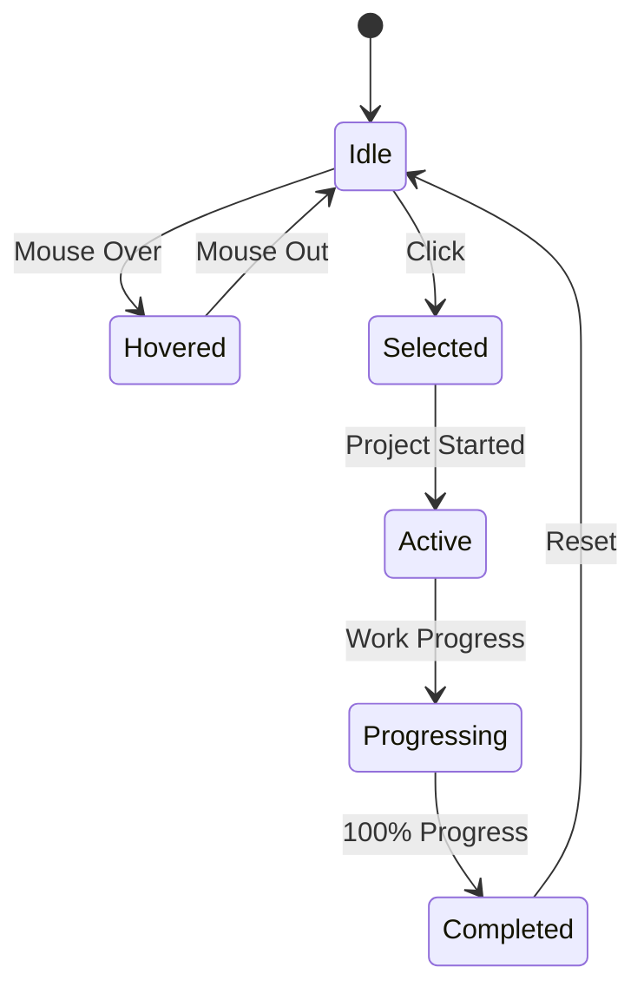
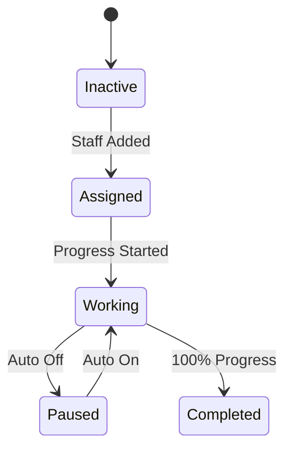
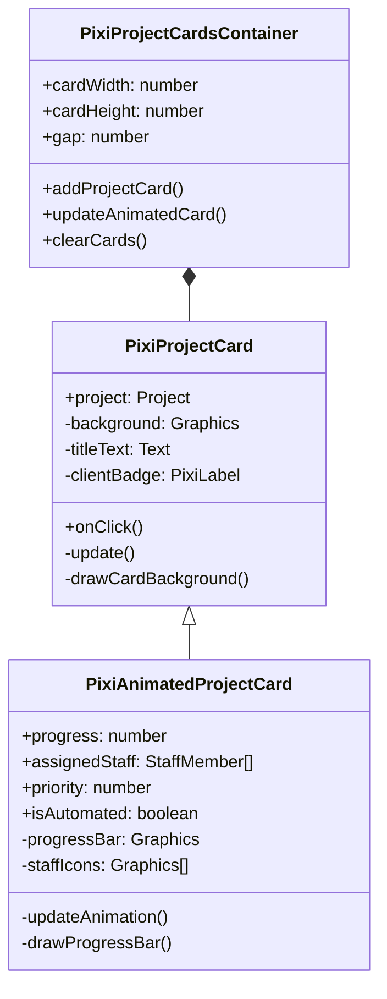

# PixiJS Project Cards Implementation Plan

## 1. Component Analysis

### Visual States

### Animation States (Animated Card)

## 2. Texture Atlas Requirements

| Asset Type          | Dimensions | Quantity | Notes                          |
|---------------------|------------|----------|--------------------------------|
| Card Backgrounds    | 220x160px  | 3        | Normal/Hover/Active states     |
| Client Badges       | 40x20px    | 5        | Different client types         |
| Genre Icons        | 24x24px    | 12       | One per music genre            |
| Difficulty Stars    | 16x16px    | 5        | 1-5 star ratings               |
| Progress Bar Parts  | 190x5px    | 2        | Background/Fill                |
| Staff Icons        | 12x12px    | 4        | Different roles (prod/eng/etc) |

## 3. Component Hierarchy

## 4. Interaction Handlers

| Interaction        | Handler                | Description                          |
|--------------------|------------------------|--------------------------------------|
| Click              | `onClickHandler`       | Selects project                      |
| Mouse Over         | `setHoverState(true)`  | Highlights card                      |
| Mouse Out          | `setHoverState(false)` | Returns to normal state              |
| Progress Update    | `updateAnimation()`    | Updates progress bar and staff icons |
| Priority Change    | `updateAnimation()`    | Updates priority display             |
| Automation Toggle  | `updateAnimation()`    | Updates automation status            |

## 5. Performance Optimization Checklist

1. **Texture Management**
   - [ ] Create single texture atlas for all card assets
   - [ ] Implement texture pooling for frequently used elements
   - [ ] Use compressed texture formats where possible

2. **Rendering Optimizations**
   - [ ] Enable sprite batching for cards
   - [ ] Limit redraws to changed elements only
   - [ ] Use simple geometries for staff icons

3. **Memory Management**
   - [ ] Implement object pooling for cards
   - [ ] Dispose unused textures properly
   - [ ] Limit text objects to necessary fields

4. **Animation Efficiency**
   - [ ] Use delta-time based animations
   - [ ] Throttle progress bar updates
   - [ ] Cache animation states

## 6. Implementation Timeline

1. **Week 1**: 
   - Finalize texture atlas
   - Implement base PixiProjectCard
   - Create bridge component updates

2. **Week 2**:
   - Add animation system
   - Implement PixiAnimatedProjectCard
   - Optimize rendering pipeline

3. **Week 3**:
   - Performance testing
   - Mobile optimization
   - Final polish