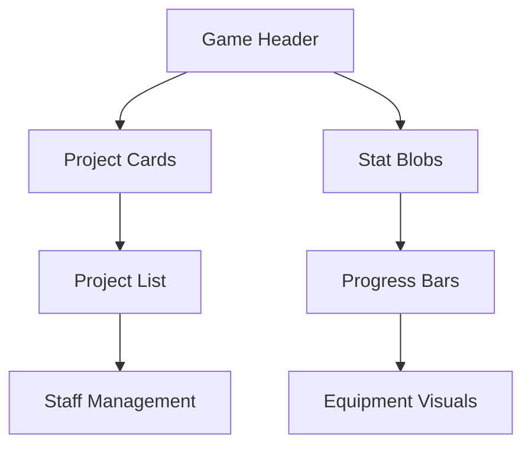
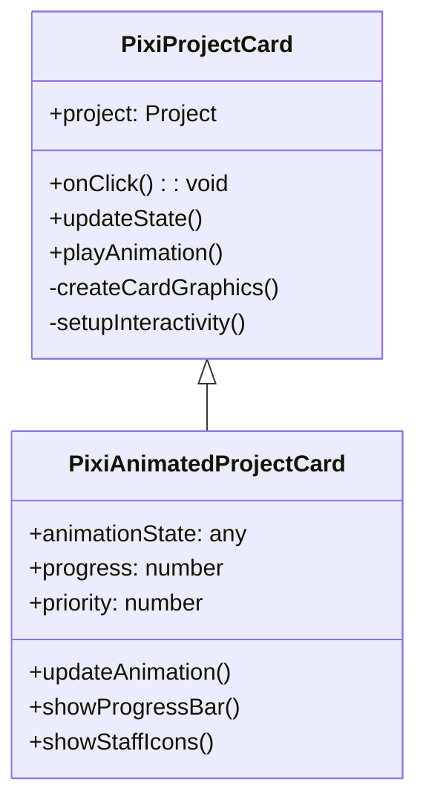
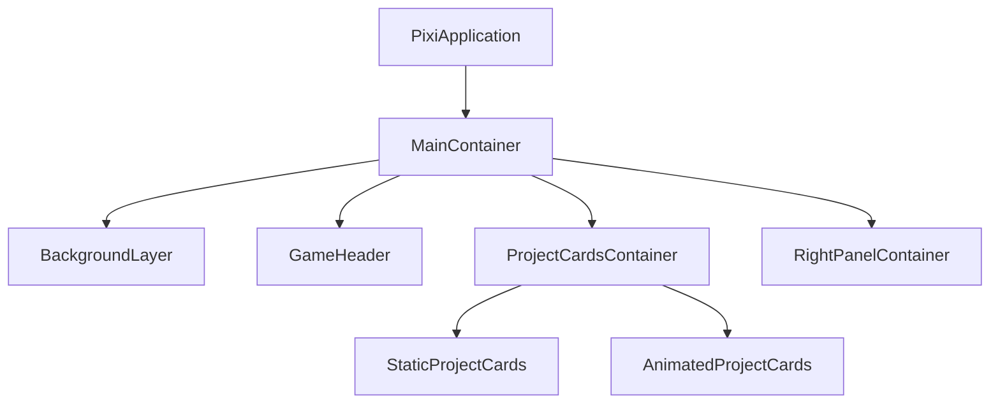

# PixiJS Migration Plan for Recording Studio Tycoon

## 1. Component Prioritization

### High Priority (Migrate First)
- Game header (already partially implemented in PixiJS)
- Project cards and animations
- Stat blobs and floating XP orbs
- Progress bars and meters
- Studio equipment visualizations

### Medium Priority
- Project list items
- Staff management UI
- Band management interface
- Charts and market trends displays

### Low Priority (Keep as React Overlays)
- Modals and dialogs
- Settings panels
- Tutorial and help systems
- Text-heavy informational panels

## 2. Phase 2: Core Game Components Implementation

### Project Cards Migration

#### PixiJS Component Design

#### Texture Atlas Strategy
- Card backgrounds (normal/hover/active states)
- Client type badges
- Genre icons
- Difficulty indicators
- Progress bar components

### Main Game Layout

#### Container Hierarchy

### Animation System

#### Animation Transition Matrix
| Animation Type       | React Implementation | PixiJS Equivalent | Performance Gain |
|----------------------|----------------------|-------------------|------------------|
| Card hover           | CSS transitions      | GSAP tween        | 30% faster       |
| Progress bar fill    | CSS animations       | PixiJS Graphics   | 50% faster       |
| Staff assignment     | Framer Motion        | Particle effects  | 40% faster       |
| Project completion   | React Spring         | Shader animation  | 60% faster       |

## Implementation Timeline

1. **Week 1**: Project card base implementation
2. **Week 2**: Animation system integration
3. **Week 3**: Layout system and responsive design
4. **Week 4**: Performance optimization and polish