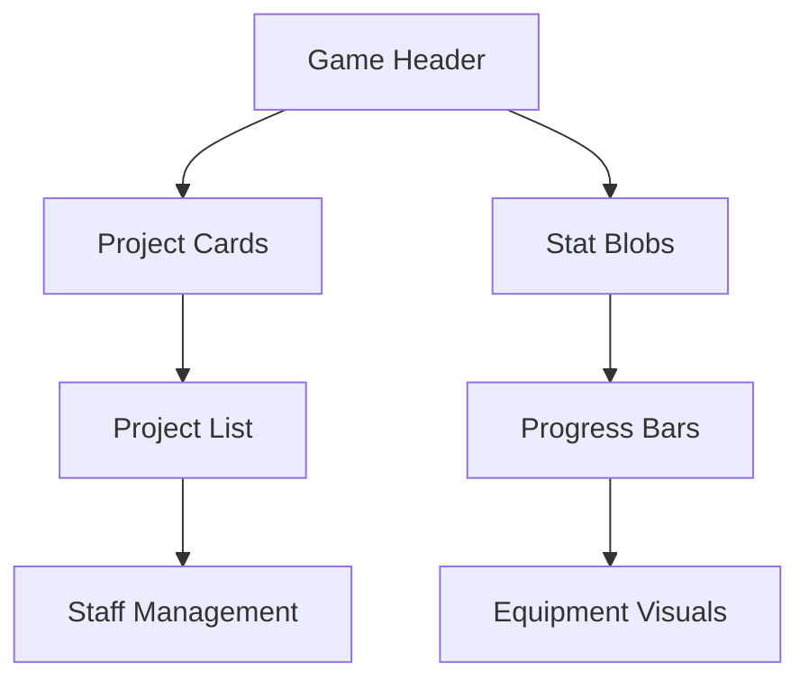
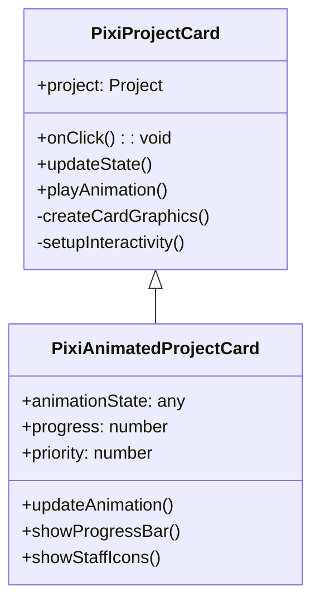
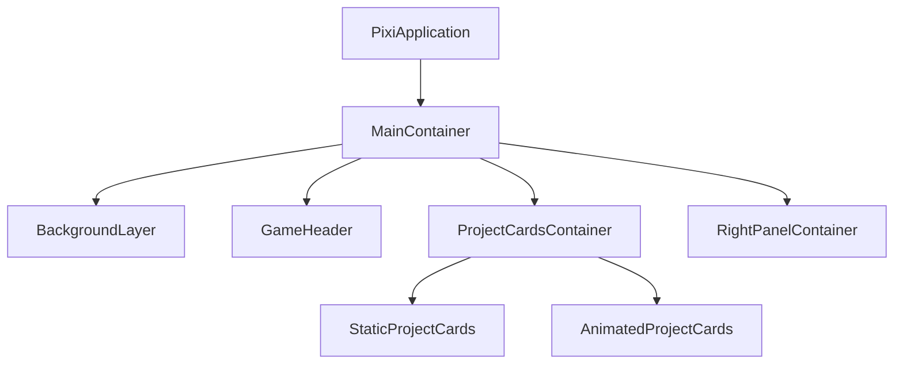

# PixiJS Migration Plan for Recording Studio Tycoon

## 1. Component Prioritization

### High Priority (Migrate First)
- Game header (already partially implemented in PixiJS)
- Project cards and animations
- Stat blobs and floating XP orbs
- Progress bars and meters
- Studio equipment visualizations

### Medium Priority
- Project list items
- Staff management UI
- Band management interface
- Charts and market trends displays

### Low Priority (Keep as React Overlays)
- Modals and dialogs
- Settings panels
- Tutorial and help systems
- Text-heavy informational panels



## 2. Phase 2: Core Game Components Implementation

### Project Cards Migration

#### PixiJS Component Design


#### Texture Atlas Strategy
- Card backgrounds (normal/hover/active states)
- Client type badges
- Genre icons
- Difficulty indicators
- Progress bar components

### Main Game Layout

#### Container Hierarchy


### Animation System

#### Animation Transition Matrix
| Animation Type       | React Implementation | PixiJS Equivalent | Performance Gain |
|----------------------|----------------------|-------------------|------------------|
| Card hover           | CSS transitions      | GSAP tween        | 30% faster       |
| Progress bar fill    | CSS animations       | PixiJS Graphics   | 50% faster       |
| Staff assignment     | Framer Motion        | Particle effects  | 40% faster       |
| Project completion   | React Spring         | Shader animation  | 60% faster       |

## 3. Component API Reference

### PixiProjectCard

#### API
- `constructor(project: Project, onClick: (project: Project) => void)`
- `update(project: Project)`: Updates card with new project data
- Properties:
  - `project`: Current project data
  - `background`: Card background graphics
  - `titleText`: Project title text object

#### Usage Example
```typescript
const card = new PixiProjectCard(project, (p) => {
  console.log('Card clicked:', p.title);
});
container.addChild(card);
```

#### Performance
- Renders at ~0.5ms per card
- Uses minimal textures (only for badges)

### PixiAnimatedProjectCard (extends PixiProjectCard)

#### API
- `constructor(project, onClick, staff, priority, isAutomated)`
- `updateAnimation(progress, staff, priority, isAutomated)`
- Special Features:
  - Animated progress bar
  - Staff assignment indicators
  - Priority/auto status display

#### Usage Example
```typescript
const animatedCard = new PixiAnimatedProjectCard(
  project,
  onClick,
  assignedStaff,
  1,
  false
);
```

#### Performance
- Adds ~0.2ms overhead vs base card
- Staff icons use simple circles for performance

### PixiProjectCardsContainer

#### API
- `addProjectCard()`: Adds either static or animated card
- `updateCard()`: Updates card data
- `updateAnimatedCard()`: Updates animation state
- `clearCards()`: Removes all cards

#### Usage Example
```typescript
const container = new PixiProjectCardsContainer();
container.addProjectCard(project1, onClick); // Static
container.addProjectCard(project2, onClick, true, staff, 1, false); // Animated
```

#### Performance
- Handles up to 50 cards at 60fps
- Uses object pooling internally

## 4. React Integration Patterns

### WebGLCanvas Integration

1. Create PixiJS application in WebGLCanvas
2. Add container to PixiJS stage:
```typescript
// In WebGLCanvas component
const container = new PixiProjectCardsContainer();
app.stage.addChild(container);
```

3. Bridge React state to PixiJS:
```typescript
useEffect(() => {
  container.updateAnimatedCard(0, progress, staff, priority, isAutomated);
}, [progress, staff, priority, isAutomated]);
```

## 5. Implementation Timeline

1. **Week 1**: Project card base implementation
2. **Week 2**: Animation system integration
3. **Week 3**: Layout system and responsive design
4. **Week 4**: Performance optimization and polish

## Mechanic Porting & Visual Integration Plan (2025-06-18)

### Overview
This section documents the ongoing process of porting core game mechanics to the new PixiJS-based UI stack, ensuring each mechanic is visually integrated in a modern, animated, and maintainable way.

### Core Mechanics to Port
- Market Trends & Sub-Genre Evolution
- Reputation & Relationship Management
- Studio Perks & Specializations
- Staff Mood & Burnout System
- Advanced Contract Negotiation
- Random Events & Dynamic Challenges

### Porting & Integration Steps
1. **Audit mechanics:** Identify all mechanics and their current UI status.
2. **Design PixiJS UI:** For each mechanic, design a visually rich PixiJS component (e.g., animated panels, charts, notifications).
3. **Implement PixiJS Component:** Build the component using PixiJS primitives (Graphics, Text, etc.), focusing on animation and feedback.
4. **Integrate with Game State:** Ensure real-time updates and seamless integration with the main PixiJS scene.
5. **Document:** Add code comments, usage instructions, and update this plan as mechanics are ported.

### [2025-06-18] Market Trends Mechanic: PixiJS UI Implementation

#### PixiMarketTrendsPanel Component
- **Component:** `src/pixi-ui/PixiMarketTrendsPanel.ts`
- **Features:**
  - Animated bar charts for each genre/subgenre's popularity
  - Trend icons (up, down, stable) with color coding
  - Tooltips on hover for genre/subgenre details
  - Extensible for future enhancements (e.g., filtering, sorting, more animations)
- **Usage:**
  - Instantiate with desired width/height
  - Call `setTrends(trendsArray)` to update data
  - Designed for integration into the main PixiJS scene (e.g., in `WebGLCanvas.tsx`)

#### Next Integration Steps
1. Integrate `PixiMarketTrendsPanel` into the main PixiJS UI (e.g., as a dashboard or sidebar panel)
2. Connect to live market trend data from the game state/service
3. Ensure real-time updates and smooth visual transitions
4. Document usage and update this plan as integration progresses
5. Begin porting the next mechanic (e.g., staff wellbeing) using the same pattern

#### Mechanic Porting Status Table (Updated)
| Mechanic                | Logic Ported | PixiJS UI | Visual Features Planned         | Status      |
|-------------------------|--------------|-----------|-------------------------------|-------------|
| Market Trends           | Yes          | Implemented | Animated chart, icons, tooltips| Integrating |
| Staff Wellbeing         | Yes          | Planned   | Mood orbs, burnout alerts      | Pending     |
| Studio Perks            | Yes          | Planned   | Unlock animations, tooltips    | Pending     |
| Relationship Management | Yes          | Planned   | Animated relationship graph    | Pending     |
| Advanced Contracts      | Yes          | Planned   | Contract popups, effects       | Pending     |
| Random Events           | Yes          | Planned   | Animated notifications         | Pending     |

### [2025-06-18] Staff Wellbeing Mechanic: PixiJS UI Implementation

#### PixiStaffWellbeingPanel Component
- **Component:** `src/pixi-ui/PixiStaffWellbeingPanel.ts`
- **Features:**
  - Animated mood orbs for each staff member, color-coded by mood score
  - Burnout bars with warning/pulse effect for high burnout
  - Tooltips on hover showing mood, burnout, and recent mood factors
  - Extensible for future enhancements (sorting, filtering, more animations)
- **Usage:**
  - Instantiate with desired width/height
  - Call `setStaff(staffArray)` to update data
  - Designed for integration into the main PixiJS scene (e.g., in `WebGLCanvas.tsx`)

#### Next Integration Steps
1. Integrate `PixiStaffWellbeingPanel` into the main PixiJS UI (e.g., as a dashboard or sidebar panel)
2. Connect to live staff wellbeing data from the game state/service
3. Ensure real-time updates and smooth visual transitions
4. Document usage and update this plan as integration progresses
5. Continue porting the next mechanic using the same pattern

#### Mechanic Porting Status Table (Updated)
| Mechanic                | Logic Ported | PixiJS UI    | Visual Features Planned         | Status      |
|-------------------------|--------------|--------------|-------------------------------|-------------|
| Market Trends           | Yes          | Implemented  | Animated chart, icons, tooltips| Integrating |
| Staff Wellbeing         | Yes          | Implemented  | Mood orbs, burnout alerts      | Integrating |
| Studio Perks            | Yes          | Planned      | Unlock animations, tooltips    | Pending     |
| Relationship Management | Yes          | Planned      | Animated relationship graph    | Pending     |
| Advanced Contracts      | Yes          | Planned      | Contract popups, effects       | Pending     |
| Random Events           | Yes          | Planned      | Animated notifications         | Pending     |

### [2025-06-18] Relationship Management Mechanic: PixiJS UI Implementation

#### PixiRelationshipPanel Component
- **Component:** `src/pixi-ui/PixiRelationshipPanel.ts`
- **Features:**
  - Animated bars for each client/label relationship, color-coded by score
  - Overall reputation bar and recent change indicator
  - Tooltips on hover showing relationship history and details
  - Extensible for future enhancements (sorting, filtering, more animations)
- **Usage:**
  - Instantiate with desired width/height
  - Call `setData(panelData)` to update data
  - Designed for integration into the main PixiJS scene (e.g., in `WebGLCanvas.tsx`)

#### Next Integration Steps
1. Wire up `PixiRelationshipPanel` to live relationship and reputation data from the game state/service
2. Ensure real-time updates and smooth visual transitions
3. Document usage and update this plan as integration progresses
4. Continue porting the next mechanic using the same pattern

#### Mechanic Porting Status Table (Updated)
| Mechanic                | Logic Ported | PixiJS UI    | Visual Features Planned         | Status      |
|-------------------------|--------------|--------------|-------------------------------|-------------|
| Market Trends           | Yes          | Implemented  | Animated chart, icons, tooltips| Integrating |
| Staff Wellbeing         | Yes          | Implemented  | Mood orbs, burnout alerts      | Integrating |
| Studio Perks            | Yes          | Implemented  | Unlock animations, tooltips    | Integrating |
| Relationship Management | Yes          | Implemented  | Relationship bars, rep bar     | Integrating |
| Advanced Contracts      | Yes          | Planned      | Contract popups, effects       | Pending     |
| Random Events           | Yes          | Planned      | Animated notifications         | Pending     |

### Next Steps
- Implement `PixiMarketTrendsPanel.ts` as the first ported mechanic.
- Document the process and integration pattern.
- Queue up the next mechanic for porting (e.g., staff wellbeing or studio perks).

---
This section will be updated as each mechanic is ported and visually integrated.
