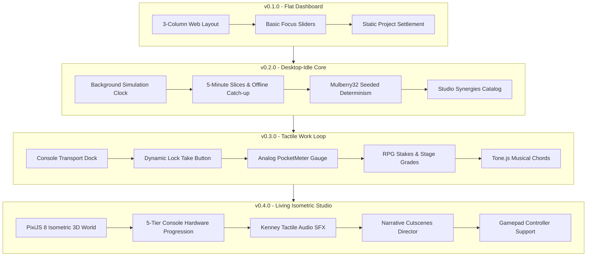

# Recording Studio Tycoon — Development Progress & History

A detailed chronological record of development milestones, architectural shifts, and feature rollouts for Recording Studio Tycoon.

---

## 🗺️ Version History & Milestone Log

### [v0.4.0] — The Living Isometric Studio & Tactile Audio Overhaul
*Released: September 29, 2026*

- **Visuals & World:**
  - Complete overhaul of `WebGLCanvas.tsx` to true isometric 3D geometry aligned with the studio room projection (`TILE_W=56, TILE_H=28`).
  - Tier-specific physical console desk progression across all 5 studio tiers (Tier 1 vintage valve desk with wood cheeks, Auratone cube monitor, and reel-to-reel tape machine; up to Tier 5 gold-trimmed flagship console with multi-rack outboard bay and dual displays).
  - Fixed phone ring animation drift by anchoring the geometry to the telephone position.
  - Responsive two-column Project Review Modal layout displaying album cover art, press critique, financial breakdown, and overall quality metrics.
- **Audio & Haptics:**
  - Integrated Tone.js Web Audio synthesis for musical chord playback upon completing project takes.
  - Added authentic Kenney mechanical switches and rotary clicks to studio gear and interactive UI elements.
  - Implemented automatic user-gesture audio unlocking wired into the global interaction system.
  - Added celebratory confetti particle juice (`canvas-confetti`) on hit records and milestones.
- **Narrative & Cutscenes:**
  - Implemented `CutsceneDirector`, `MinigameOutcomeCutscene`, and `CinematicStoryCutscene`.
  - Added studio ambient backdrops and career milestone cutscenes.
- **Controls & Input:**
  - Introduced Gamepad Service with 60fps controller polling, dynamic SVG glyph rendering, and spatial UI navigation.

---

### [v0.3.0] — Interactive Console Work Loop & RPG Progression
*Released: September 28, 2026*

- **Work Loop Overhaul:**
  - Replaced passive text buttons with an industrial Console Transport Dock and dynamic 60fps Lock Take button.
  - Created the rackmount analog PocketMeter gauge measuring timing window accuracy for Gold, Silver, and Solid takes.
  - Implemented variable energy take progression (1⚡ efficient, 2⚡ standard, 3⚡ Overdrive with +75% boost).
- **Fun-First RPG Systems:**
  - Built Take Evaluation engine calculating performance scores from timing accuracy and focus.
  - Introduced Combo Codex for consecutive take streaks and multiplier bonuses.
  - Added Contract Stakes: Safe Contracts vs high-payout Moonshot Stakes.
  - Implemented S/A/B/C Stage Grades for tracking, overdubs, mixing, and mastering.
  - Added unified XP progression across producer attributes and studio expansion.
  - Implemented 5 Producer Origins and authored Studio Lore with 8 Console Laws.

---

### [v0.2.0] — Desktop-Idle Simulation Core & Seeded RNG
*Released: September 27, 2026*

- **Simulation Engine:**
  - Implemented 5-minute background simulation time slicing live and offline.
  - Offline catch-up capped at 8 hours with Welcome Back summary modal (`WelcomeBackSummaryModal.tsx`).
  - Integrated Mulberry32 deterministic seeded RNG (`seededRandom.ts`) for reproducible project reviews and interventions.
- **Studio Synergies:**
  - Designed 20 authored synergy combinations combining room types, equipment, staff skills, and artist genres.
  - Created interactive Synergy Encyclopedia and badge discovery system.
- **Economy & Retention:**
  - Daily challenge generator with seeded rotation.
  - Daily operating costs, staff salaries, equipment upkeep, and financial reports.

---

### [v0.1.0] — Foundation Prototype (June 2025 Archive)
*Released: June 2025*

- **Initial Architecture:**
  - 3-column React dashboard (Available Projects, Active Project Focus Sliders, Equipment Shop & Staff).
  - 15 foundational web minigames (EQ Matching, Vocal Tuning, Tape Splicing, Beat Making, etc.).
  - Basic project review generator and financial accounting.
  - Initial equipment progression and staff recruitment system.

---

## 📈 Architecture Evolution

---

*Recording Studio Tycoon — Progress Documentation*
