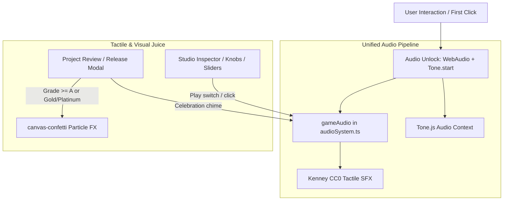

# Gameplay Iteration: Open Source Tools, Assets, and Milestone Juice Integration

## 1. Executive Summary & Confidence Gatekeeping

To iteratively enhance gameplay feel ("juice"), tactile interaction, and audio fidelity in *Recording Studio Tycoon*, we evaluated open source tools and assets, gatekept by confidence:

| Candidate | Category | Confidence | Status | Rationale |
| :--- | :--- | :--- | :--- | :--- |
| **Tone.js (`tone`)** | Audio Engine | **95% (High)** | **Phase 1 (Active)** | Official Web Audio framework referenced in project roadmap. Replaces timer-drifted `setInterval` loops; enables synths and DSP effects. |
| **Kenney UI Audio (CC0)** | Audio Assets | **95% (High)** | **Phase 1 (Active)** | 50 public domain (CC0) clicks, switches, snaps, and toggles for tactile studio hardware feel. |
| **Canvas Confetti (`canvas-confetti`)** | Visual Juice | **90% (High)** | **Phase 1 (Active)** | Lightweight (<6KB), zero-dependency canvas particle effects for Gold/Platinum album releases and chart milestones. |
| **Multi-track Stem Player** | Minigame Mechanic | 70% (Medium) | Phase 2 (Queued) | Tone.js Players with dynamic 3-band EQ for actual audio mixing in `MixingBoardGame`. |
| **Web Audio VU Meter** | UI Visualizer | 65% (Medium) | Phase 2 (Queued) | Real-time `AnalyserNode` driving analog needle / LED meters in PixiJS studio room. |
| **Heavy DAW / GenAI Audio** | Bloat / Latency | 15% (Low) | Shelved | Exceeds scope, introduces latency and third-party API dependencies. YAGNI. |

---

## 2. Architecture & System Flow

---

## 3. Concrete Phase 1 Implementation Plan

### A. Dependencies & Tooling
- Package Manager: `pnpm` (configured in workspace with ExFAT safety).
- Install:
  - `tone`
  - `canvas-confetti`
  - `@types/canvas-confetti` (devDep)

### B. Asset Ingestion
- Download Kenney CC0 UI Audio assets into `public/audio/ui-sfx/kenney/`:
  - `click1.wav` ... `click5.wav` (tactile button presses)
  - `switch1.wav` ... `switch3.wav` (rack gear toggles and power switches)
- Map new assets in `src/utils/audioSystem.ts`:
  - `gameAudio.playTactileClick()`
  - `gameAudio.playGearSwitch()`

### C. Visual & Tactile Juice Integration
- **Milestone Celebration**:
  - In `src/components/modals/ProjectReviewModal.tsx` and `src/components/ProjectCompletionCelebration.tsx`:
  - Trigger celebratory confetti burst on high quality release (Quality >= 80 or Grade A/S) and Gold/Platinum record awards.
- **Studio Hardware Feedback**:
  - Connect tactile sounds to studio room purchases and equipment interactions.

### D. Audio Context Synchronization
- Update `audioSystem.userGestureSignal()` to safely start `Tone.context` if suspended, ensuring synchronization between native Web Audio nodes and Tone.js.

---

## 4. Error Handling & Edge Cases
- **Audio Autoplay Policy**: `Tone.start()` and `audioContext.resume()` guarded against user-gesture restrictions; gracefully no-ops if browser blocks sound.
- **Headless & SSR / Test Environment**: Canvas confetti safely checks for `typeof window !== 'undefined'` and does not crash in test runners.
- **Volume Settings**: All Kenney UI sounds route through `sfxGain` to respect player volume preferences and muting.

---

## 5. Verification & Testing
- Automated check runner: `bash scripts/run-checks.sh` must remain 100% passing.
- Smoke check: Verify assets load via HTTP/Vite dev server without 404s.
- Build check: `pnpm run build` must compile cleanly with SWC/Vite without TypeScript or bundling errors.
