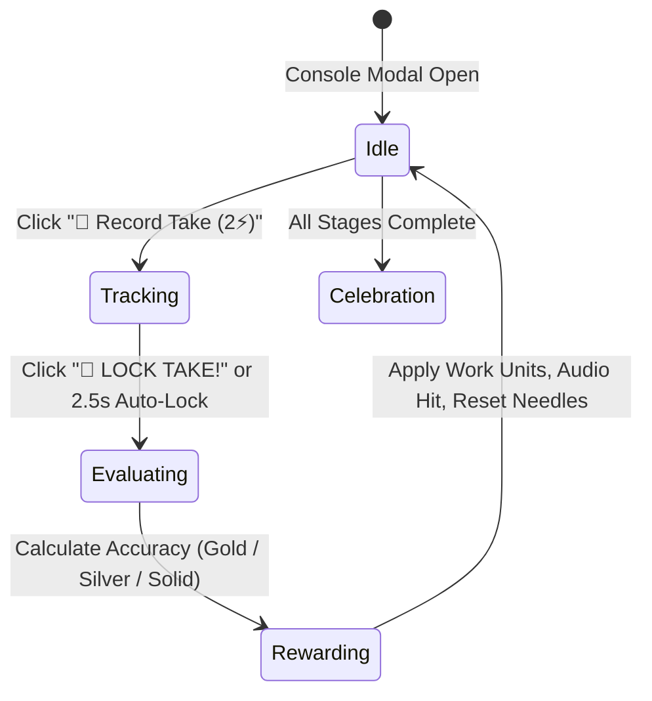

# Interactive Studio Console: "Hit The Pocket" Take Recording & Hardware Aesthetic Overhaul

## 1. Problem Statement & Objectives
- **Current Issue**: Clicking "Work on Project" feels like a repetitive idle clicker game. Each click burns 1 energy for tiny progress (~1 unit), requiring 20–40 monotone clicks across multiple days to finish a single song with no meaningful interactivity or satisfaction.
- **Objectives**:
  1. **Interactive & Fun**: Replace the single click button with a tactile "Hit The Pocket" console take mechanic (aim for the sweet-spot on an analog VU meter).
  2. **Fast & Satisfying Pacing**: Adaptive take spending (2 energy default, 1 energy fallback) clearing stages in 2–3 meaningful takes instead of 20+ micro-clicks.
  3. **Iconic Studio Hardware Aesthetic**: Drop generic rounded cards in favor of a 19" rackmount/mixing desk aesthetic with machined chamfers, metal bevels, corner rack-bolts, and illuminated Neve/SSL-style push buttons.
  4. **Tactile Audio & Visual Juice**: Real-time Tone.js chords/stems, tape-reel recoil, and Gold/Silver/Solid take verdicts.

---

## 2. Core Architecture & Interaction State Flow

### A. Interaction States
1. **`IDLE` (Transport Armed)**:
   - Primary button: `🔴 RECORD TAKE (2⚡ · 4-6 units)` (automatically switches to `1⚡ · 2-3 units` if only 1 energy remains).
   - Secondary button: `🔥 ARM OVERDRIVE (+1⚡ · +75% output)`.
   - Displays session energy remaining and current stage progress.

2. **`TRACKING` ("Hit The Pocket" Active Take)**:
   - Clicking `Record Take` engages the recording bus with a tactile relay switch sound.
   - An analog needle swings dynamically across a backlit gauge.
   - **The Pocket Target Zone**: Highlighted between 70% and 85% of the meter with an incandescent warm amber glow.
   - Primary button transforms into an active, pulsing `🎯 LOCK TAKE!`.
   - **Auto-Lock Fallback**: If the player does not click within 2.5 seconds, the take locks in automatically at the current needle position (zero frustration / no deadlocks).

3. **`EVALUATING` & `REWARDING`**:
   - Accuracy evaluation:
     - **Gold Take** (Needle inside The Pocket, 70%–85%): **+30% bonus work units**, **+4 track quality**, golden glow pulse, energetic chord/drum hit.
     - **Silver Take** (Near-miss, 50%–69% or 86%–95%): **+10% bonus work units**, **+2 track quality**, clean studio chord hit.
     - **Solid Take** (Outside target): Standard base progress (no penalty).
   - Tone.js synthesizes a genre-matched chord/drum hit and triggers a tape stop sound.
   - Stage progress bar leaps forward by 4–7 units.

---

## 3. Visual Aesthetic Overhaul: Industrial Studio Console

Replace generic rounded borders (`rounded-2xl`, bubbly pills) with classic 19" rackmount and mixing console design language:
- **Chassis**: Matte gunmetal finish (`bg-slate-950`, `border-slate-800`), 2px precision corners (`rounded-[2px]`), subtle metallic top-light bevel (`shadow-[inset_0_1px_0_rgba(255,255,255,0.08)]`).
- **Corner Fasteners**: Decorative Allen/hex rack screws in the corners (`[+]` recessed metal bolts) reinforcing the physical studio gear presence.
- **Console Transport Buttons**: Square/rectangular push-buttons with illuminated internal LEDs (reminiscent of SSL / Neve console solo/cut/rec buttons) and tactile border highlights.
- **Silk-Screened Typography**: Technical uppercase monospace markings (`REC BUS 01`, `TARGET: +3dBu`, `PEAK/RMS`, `PHANTOM 48V`).

---

## 4. Audio Engine Integration (Tone.js + Kenney SFX)

- **Arm Take**: Plays tactile mechanical switch sound (`gameAudio.playGearSwitch()`).
- **Lock Take Verdict**:
  - Gold Take: Tone.js polyphonic chord (genre-tailored: major 7th for Pop/Soul, power fifth for Rock, synth stab for Electronic) + `click2.wav` tape latch.
  - Silver Take: Tone.js clean triad.
  - Solid Take: Tone.js percussion snap.
- **Stage Completion**: `gameAudio.playUISound('stageComplete')` + celebratory screen punch.

---

## 5. Mathematical Balancing & Pacing Model

- **Energy Cost**:
  - `energyCost = Math.min(2, gameState.playerData.dailyWorkCapacity)`.
  - Overdrive adds 1 extra energy if available.
- **Work Units Generated per Take**:
  - Base units scaled by energy spent: `baseUnits = energyCost === 2 ? 4 : 2`.
  - Multipliers applied:
    - Focus allocation effectiveness (0.8x to 1.3x).
    - Studio room & synergy bonuses (1.0x to 1.5x).
    - Take grade multiplier: Gold (`1.3x`), Silver (`1.1x`), Solid (`1.0x`).
  - Expected progress per 2-energy take: **4 to 7 work units**.
- **Stage & Project Duration**:
  - Standard early stage (8–12 units): Completes in **2 to 3 takes** (approx 4–6 energy = 1 day of studio work).
  - Full 3-stage track: Completes in **6 to 8 focused takes** over 2 in-game days.
  - Eliminates 30-click grinding while making each take feel like a high-stakes musical performance.

---

## 6. Implementation Components & Files Touched

1. **`src/components/console/PocketMeter.tsx`** (New component):
   - Backlit analog gauge with oscillating needle, illuminated "Pocket" target zone, and precision rackmount frame.
2. **`src/components/ActiveProject.tsx`**:
   - Modernize modal container with industrial console chassis (drop rounded pills, add rack screws, hardware styling).
   - Integrate "Record Take" / "Lock Take" transport dock.
   - Wire `PocketMeter` and handle take evaluation.
3. **`src/hooks/useStageWork.tsx`**:
   - Support variable energy expenditure (`energyToSpend: 1 | 2 | 3`) and take grade multiplier (`takeBonusMultiplier`).
   - Fix latent variable references (`rawCreativity` / `rawTechnical` / `updatedDiscovered`) to ensure pristine type-safety and robust execution.
4. **`src/utils/audioSystem.ts`**:
   - Tone.js helper for instant genre chord synthesis upon take completion.
5. **`tests/pocket-take.check.ts`** (New test suite):
   - Verify take evaluation logic, energy adaptation, grade bonuses, and stage progression rates.
