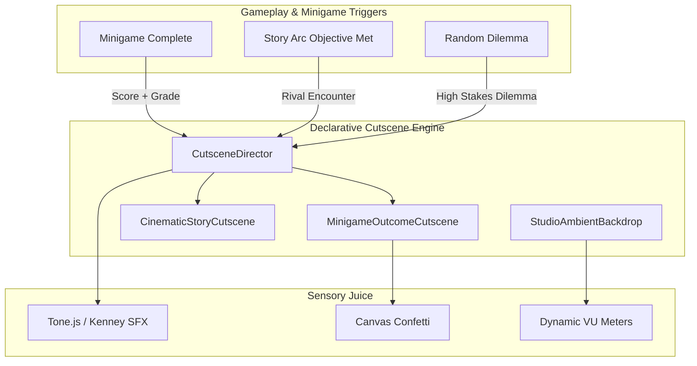

# Narrative Cutscenes and Ambient System Design

## 1. Executive Summary
This spec outlines the architecture and implementation of a native React + Framer Motion cutscene director, dynamic era-adaptive studio ambient backgrounds, and an expanded 3-act narrative structure for all four playstyles. The goal is to deepen game dynamics and lore integration without introducing external engine bloat, preserving the existing React 19 + Vite architecture.

## 2. Architecture & State Flow

### Key Components
- **`StudioAmbientBackdrop.tsx`**: Lightweight, era-adaptive background (CSS + Canvas) rendering spinning tape reels and VU meters, sitting beneath the studio UI.
- **`MinigameOutcomeCutscene.tsx`**: High-impact vignette displaying performance tier (S/A/B/C/Fail), artist reaction, and XP flights.
- **`CinematicStoryCutscene.tsx`**: Letterboxed story modal with typewriter dialogue, character portraits, and dilemma choices.
- **`useCutsceneQueue.ts`**: State management to serialize cinematic events and handle skip controls.

## 3. Dynamic Studio Animated Backgrounds

- **Era-Reactive Aesthetics**:
  - *1960s–1970s (Analog)*: Amber vacuum tube glow, twin reel-to-reel tape decks (momentum physics), analog dual-needle VU meters.
  - *1980s–1990s (Synth/Digital)*: Cyan/magenta lighting, rack gear blinking LEDs, 12-segment green/amber/red LED ladders.
  - *2000s+ (DAW)*: Dark slate panels, clean monitor glow, sleek spectral bars.
- **Performance**:
  - `pointer-events-none` container.
  - CSS GPU-accelerated transforms.
  - Auto-pauses on `document.hidden`.
  - Honors `prefers-reduced-motion` (static vintage display).

## 4. Post-Minigame Outcomes & Interventions

- **S-Tier (Score ≥ 850)**: Gold sheen, confetti burst, major chord stinger, high artist inspiration boost, potential rival jealousy trigger.
- **A / B Tier (Score 400–849)**: Crisp audio chime, standard XP/Creativity flights.
- **Failure (Score < 300)**: Tape-stop stinger, console shudder, invokes Console Law #1 (Law of the Red Light) offering tactical breather choices.
- **Zero Flow-Breaking**: Auto-dismisses after 2.5s or instantly via `Escape`, `Enter`, or click. Story progression offers a glowing "Advance Story" button.

## 5. Expanded Story Arcs & Rival Showdowns

Complete 3-Act structures for the 4 core playstyles:
1. **The Purist vs. Silas Vance** (*Black Wax Vault*): Analog vs. Digital.
2. **The Hit-Maker vs. Chad Sterling** (*Apex Velocity*): Algorithmic hits vs. artistic integrity.
3. **The Underground vs. Roxy Riot** (*Distortion Cellar*): DIY subculture vs. major labels.
4. **The Sound-Lab vs. Dr. Aris Thorne** (*Silicon Harmonics*): Sonic experimentation and harmonic frequencies.

*Cinematic Story Cutscenes* unlock corresponding **Console Laws** in the codex and provide branching dilemma choices with real gameplay consequences.

## 6. Verification & Edge Cases

- **Skip / Anti-Trap**: `Escape`, `Enter`, `Space`, or outside-click always dismisses instantly. Portal nodes clean up fully.
- **Audio Context**: Gracefully handles blocked autoplay and mutes on tab switch.
- **Testing**: Automated `tests/narrative-cutscenes.check.ts` to verify arc completeness.
