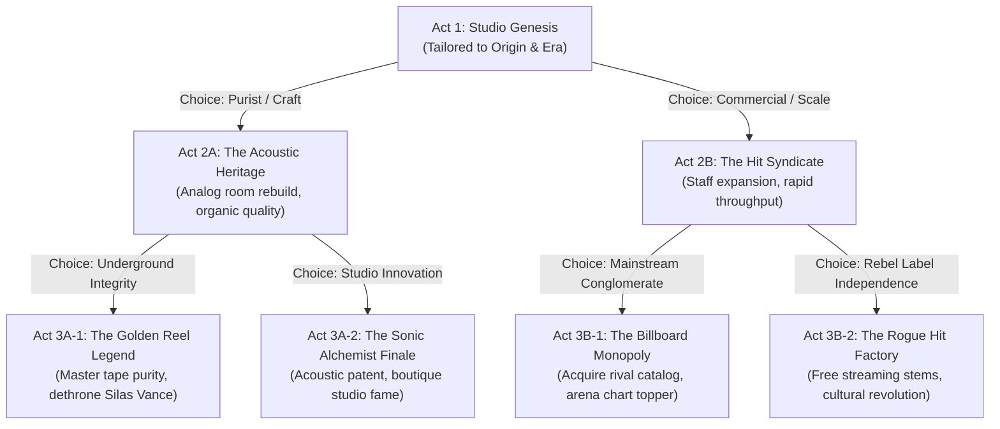

# Branching Deterministic Random Storylines Design

**Date:** 2026-09-29  
**Status:** Approved for Implementation  
**Topic:** Branching Deterministic Storylines with Procedural Variation & Start Condition Reactivity  

---

## 1. Executive Summary & Goals

This system introduces a **Hybrid Procedural Narrative Engine** into *Recording Studio Tycoon*:
1. **A Bespoke 3-Act Seeded Campaign Tree:** Every playthrough generates a deterministic 3-Act storyline tailored to the player's Producer Origin (`bedroom-beatmaker`, `tape-purist`, `hit-factory-mercenary`, etc.), starting Era (`vintage-warmth`, `analog-renaissance`, `digital-revolution`, `modern-streaming`), and chosen playstyle.
2. **Branching Trajectories:** Act 1 decisions split Act 2 into 2 distinct paths (e.g., Commercial Aggression vs Acoustic Integrity), which in turn branch into 4 unique Act 3 Finales, yielding 4 completely divergent endings per run.
3. **Subtle Procedural Variation Every Run:** Utilizing the Mulberry32 PRNG seeded from game initialization conditions, dialogue lines, rival studio foils, client names, acoustic obstacles, and milestone thresholds subtly adapt on every new studio creation while remaining 100% reproducible for a given seed and choice path.
4. **Emergent Episodic Subplots:** Multi-day procedural side-stories (e.g., *The Vinyl Bootleg Scandal*, *Ghost Producer Ultimatum*, *Demolition Salvage Bid*) that spin off dynamically during daily studio operations and weave back into the main storyline flags.

---

## 2. Core Architecture & Deterministic Seed Derivation

### 2.1 Seed Pipeline
All narrative rolls are strictly deterministic and isolated from transient UI states:
```typescript
// In src/narrative/branchingStorylineEngine.ts
import { hashSeed, createSeededRandom, RandomSource, pickWithRandom } from '@/simulation/seededRandom';

export interface RunSeedContext {
  saveSeed: number | string;
  selectedEra: string;
  originId: string;
  playstyle: string;
}

export const deriveStorylineRunSeed = (ctx: RunSeedContext): number => {
  return hashSeed(`${ctx.saveSeed}:${ctx.selectedEra}:${ctx.originId}:${ctx.playstyle}`);
};

export const createNodeRng = (runSeed: number, nodeId: string, stepIndex = 0): RandomSource => {
  return createSeededRandom(hashSeed(`${runSeed}:${nodeId}:${stepIndex}`));
};
```

### 2.2 Procedural Grammar & Mad-Lib Synthesis
Procedural text generation uses token replacement with deterministic vocabulary pools:
* `{rivalName}`: Silas Vance, Chad Sterling, Roxy Riot, Dr. Vance Thorne, Felix Belmont, Victoria Chase.
* `{rivalStudio}`: Black Wax Vault, Apex Velocity, The Anarchy Soundboard, Neon Synthworks, Velvet Static Collective.
* `{legendaryVenue}`: The Marquee Cellar, The Electric Ballroom, Warehouse 9, The Sunset Strip.
* `{targetGenre}`: Derived from Origin's signature genres and the current Era's market trends.
* `{gearMotif}`: 2-inch 24-Track Studer, Neve discrete console, MPC 3000 sampler, vintage Telefunken U47.

---

## 3. Data Models & GameState Integration

### 3.1 Storyline State Schema
Added additively to `GameState` in `src/types/game.ts` (100% backwards-compatible with existing saves):

```typescript
export interface StorylineBranchRecord {
  nodeId: string;
  chosenOptionId: string;
  resolvedDay: number;
  storyFlagGranted: string;
}

export interface ActiveSubplotState {
  subplotId: string;
  currentStage: 1 | 2;
  startedDay: number;
  stage1ChoiceId?: string;
}

export interface StorylineState {
  runSeed: number;
  activeCampaignNodeId: string; // e.g. "act1_genesis"
  campaignCompleted: boolean;
  branchHistory: StorylineBranchRecord[];
  activeSubplots: ActiveSubplotState[];
  resolvedSubplotIds: string[];
  storyFlags: Record<string, boolean | number | string>;
}
```

### 3.2 Campaign Node & Branch Dilemma
```typescript
export interface StorylineBranchOption {
  id: string;
  label: string;
  flavorText: string;
  targetNodeId: string; // Next Act branch
  playstyleTag: string;
  storyFlag: string;
  consequences: {
    moneyDelta: number;
    repDelta: number;
    creativeCapitalDelta?: number;
    narrativeOutcome: string;
  };
}

export interface StorylineNode {
  id: string;
  act: 1 | 2 | 3;
  branchPath: string; // e.g., "root", "act2_purist", "act2_commercial", "act3_legend"
  title: string;
  loreBrief: string;
  objectiveDescription: string;
  rivalStudioId: string;
  rivalDialogue: string;
  requiredTarget: {
    genre?: string[];
    minQuality?: number;
    sessionCount?: number;
    moneyTarget?: number;
    reputationTarget?: number;
    unlockedRooms?: number;
  };
  completionReward: {
    money: number;
    reputation: number;
    xp: number;
    titleOrPerk: string;
  };
  branchDilemma?: {
    id: string;
    kicker: string;
    context: string;
    options: StorylineBranchOption[];
  };
}
```

---

## 4. The 3-Act Branching Campaign Tree



### 4.1 Emergent Subplot Pool (Procedural 2-Step Threads)
Triggered dynamically during the daily simulation tick when state conditions match:
1. **The Vinyl Bootleg Scandal:** (Trigger: Day ≥ 8, Rep ≥ 20).
   * Stage 1: Uncredited pressings surface in local record stores. Choose to seize the press or sign the pirate distributor.
   * Stage 2 (4 days later): Aftermath dilemma with radio stations or underground vinyl collectors.
2. **The Ghost Producer Ultimatum:** (Trigger: Day ≥ 14, Money ≤ 5000).
   * Stage 1: Anonymous major label offer of $6,000 for uncredited hit.
   * Stage 2 (5 days later): Rival discovers the audio stems and threatens blackmail.
3. **The Demolition Salvage Desk:** (Trigger: Day ≥ 10, Rooms ≥ 1).
   * Stage 1: Abandoned theatre sells a discrete 1974 console for scrap.
   * Stage 2 (3 days later): Power supply explodes or produces miraculous harmonic depth.
4. **The S-Grade Prodigy Clash:** (Trigger: 1+ S-Grade session achieved).
   * Stage 1: Prodigy session musician requests exclusive production rights.
   * Stage 2 (4 days later): Major record label bidding war.

---

## 5. UI Surfacing & Presentation

1. **CareerHub Integration (`CareerHub.tsx`):**
   * Displays the active Campaign Act badge, title, and live objective tracker (e.g. `Act 1: Acoustic Foundation (2/3 Rock Takes ≥ 75 Quality)`).
   * Expandable "Storyline Log" showing previous branch decisions, active rival foil, and acquired story flags.
2. **Storyline Branch Modal (`NarrativeChoiceModal.tsx` reuse/extension):**
   * When an Act objective completes, a cinematic decision modal triggers with the rival’s confrontation, audio feedback, and the divergent branch choices.
   * Explicitly previews the downstream branch path and gameplay perks.

---

## 6. Verification & Invariants

* **Invariants to verify via `tests/branching-storylines.check.ts`:**
  1. *Determinism Invariant:* Identical `(seed, origin, era, playstyle, choices)` produce 100% byte-identical campaign nodes, text, and outcomes across separate runs.
  2. *Tree Traversability:* Every branch option in Act 1 maps to a valid Act 2 node; every Act 2 option maps to a valid Act 3 finale; no dead-end nodes.
  3. *Save Safety:* Old save states without `storylineState` smoothly initialize with non-destructive defaults upon loading.
  4. *Objective Validation:* All completion checkers safely evaluate against `GameState` without mutating state or throwing on undefined fields.
