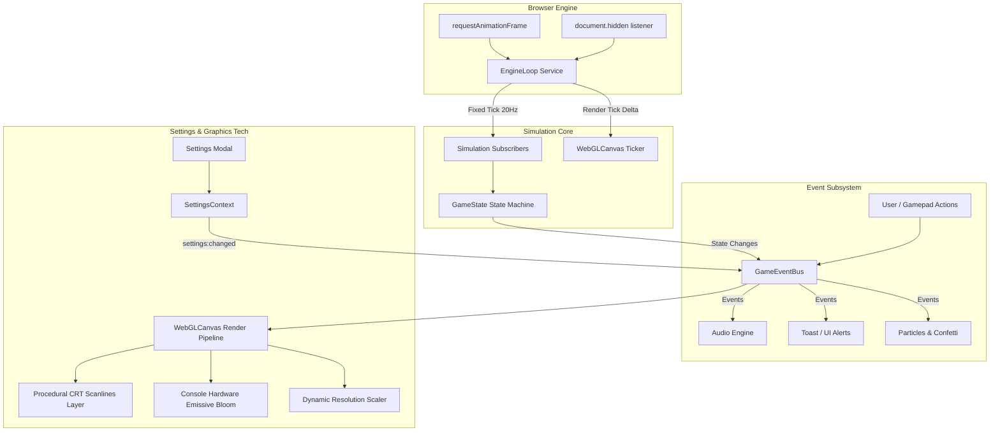

# Game Engine Back-End, Settings Overhaul & PixiJS Graphics Tech Architecture Specification

*Recording Studio Tycoon - Milestone v0.4.5 Technical Specification*  
*Date: September 29, 2026*

---

## 1. Executive Summary

This specification defines the architecture for the core Game Engine Back-End, unified Settings Engine, and PixiJS Graphics Tech in *Recording Studio Tycoon*. 

The system achieves three primary goals:
1. **Decoupled Engine Simulation**: An authoritative, fixed-step tick loop (`engineLoop.ts`) with delta-time accumulation (20Hz simulation) and tab-unfocused power budgeting, accompanied by a typed, zero-overhead event bus (`gameEventBus.ts`) to isolate state changes from React rendering trees.
2. **Comprehensive Settings System**: An overhauled multi-tab Settings Modal (Audio, Graphics & Display, Gameplay & Controller, Accessibility, Language & Themes) managing resolution scaling, target frame rate, retro post-fx, and accessibility helpers.
3. **Elevated PixiJS Graphics Pipeline**: Integration of dynamic DPI/resolution scaling, procedural CRT scanlines with vignette, console hardware bloom/emissive glow with additive blending, and frame-budget limiter into `WebGLCanvas.tsx`.

---

## 2. Architecture & Data Flow



---

## 3. Subsystem Specifications

### 3.1. Unified Engine Loop (`src/engine/engineLoop.ts`)

#### 3.1.1. Core Requirements
- Runs decoupled from React render lifecycles using `requestAnimationFrame`.
- Implements a fixed-step simulation accumulator (`FIXED_STEP = 0.050` s / 20Hz) to ensure deterministic physics, time-slicing, and buff expirations regardless of client FPS.
- Computes variable render delta (`renderDeltaSec`) clamped to `MAX_DELTA = 0.250` s to prevent spiral-of-death time jumps when returning from background tabs or device sleep.
- Detects `document.hidden` via Page Visibility API and throttles simulation to 1Hz tick rate to conserve battery and CPU resources on laptops and mobile devices.

#### 3.1.2. Public Interface
```typescript
export interface EngineTickEvent {
  deltaSec: number;
  totalTimeSec: number;
  isBackground: boolean;
}

export interface EngineLoopService {
  start: () => void;
  stop: () => void;
  isRunning: () => boolean;
  onTick: (callback: (e: EngineTickEvent) => void) => () => void;
  onFixedTick: (callback: (fixedDeltaSec: number) => void) => () => void;
  setTargetFps: (fps: number) => void;
}
```

---

### 3.2. Strongly Typed Game Event Bus (`src/engine/gameEventBus.ts`)

#### 3.2.1. Core Requirements
- Lightweight pub/sub architecture in pure TypeScript with zero runtime external dependencies.
- Completely decouples deep domain logic (e.g. `takeEvaluation`, `stageGrades`, `ProgressionSystem`) from UI components and audio players.
- Provides `emit`, `on`, `once`, and `off` methods with strict type safety across all emitted payloads.

#### 3.2.2. Event Map Definition
```typescript
export interface GameEventPayloads {
  // Project & Recording Work Loop
  'project:take_locked': {
    projectId: string;
    grade: 'Gold' | 'Silver' | 'Solid';
    energyBurned: number;
    score: number;
    takeNumber: number;
  };
  'project:stage_advance': {
    projectId: string;
    stageIndex: number;
    stageName: string;
  };
  'project:completed': {
    projectId: string;
    finalGrade: string;
    revenue: number;
    reputationGain: number;
  };

  // Studio Progression
  'studio:tier_upgraded': {
    oldTier: number;
    newTier: number;
  };
  'studio:day_advanced': {
    currentDay: number;
  };

  // Audio & Tactile Triggers
  'audio:trigger_cue': {
    soundId: string;
    category?: 'sfx' | 'ui' | 'take';
    volume?: number;
  };

  // Settings & System
  'settings:changed': {
    changed: Partial<GameSettings>;
    all: GameSettings;
  };
  'graphics:resolution_changed': {
    scale: number;
    effectiveDpr: number;
  };
}

export type GameEventKey = keyof GameEventPayloads;
```

---

### 3.3. Settings Schema & Modal Overhaul (`src/contexts/`, `src/components/modals/`)

#### 3.3.1. Expanded `GameSettings`
```typescript
export interface GameSettings {
  // Audio
  masterVolume: number;        // 0..1
  sfxVolume: number;           // 0..1
  musicVolume: number;         // 0..1
  sfxEnabled: boolean;
  musicEnabled: boolean;

  // Graphics & Display
  graphicsPreset: 'low' | 'medium' | 'high' | 'ultra';
  resolutionScale: 0.75 | 1.0 | 1.25 | 1.5 | 2.0;
  targetFps: 30 | 60 | 120 | 0; // 0 = unconstrained/vsync
  crtScanlines: boolean;        // Procedural retro scanline & curvature layer
  analogTapeWarmth: boolean;    // Warm color grading, subtle vignette
  bloomAndGlow: boolean;        // Console switches, VU meter lights, glowing displays

  // Gameplay & Controller
  difficulty: 'easy' | 'medium' | 'hard';
  autoSave: boolean;
  controllerLayout: ControllerLayoutPreference;
  gamepadHaptics: boolean;
  tutorialCompleted: boolean;
  seenMinigameTutorials: Record<string, boolean>;

  // Accessibility
  screenShake: boolean;         // Celebration/milestone screenshake
  reducedMotion: boolean;       // Honors OS prefers-reduced-motion or manual toggle
  pocketMeterAssistance: 'strict' | 'normal' | 'generous'; // +/- tolerance

  // Customization
  theme: 'default' | 'sunrise-studio' | 'neon-nights' | 'retro-arcade';
  language: string;
}
```

#### 3.3.2. Preset Mapping Logic
```typescript
export const GRAPHICS_PRESETS: Record<GameSettings['graphicsPreset'], Partial<GameSettings>> = {
  low: {
    resolutionScale: 0.75,
    targetFps: 30,
    crtScanlines: false,
    analogTapeWarmth: false,
    bloomAndGlow: false,
  },
  medium: {
    resolutionScale: 1.0,
    targetFps: 60,
    crtScanlines: false,
    analogTapeWarmth: true,
    bloomAndGlow: false,
  },
  high: {
    resolutionScale: 1.0,
    targetFps: 60,
    crtScanlines: true,
    analogTapeWarmth: true,
    bloomAndGlow: true,
  },
  ultra: {
    resolutionScale: 1.5,
    targetFps: 120,
    crtScanlines: true,
    analogTapeWarmth: true,
    bloomAndGlow: true,
  },
};
```

#### 3.3.3. UI / Modal Layout
- Tabbed view with 5 distinct sections:
  1. 🔊 **Audio**: Master, SFX, and Music volume faders.
  2. 📺 **Graphics & Display**: Presets selector, resolution scaling, target FPS, retro scanlines, tape warmth, bloom toggles.
  3. 🎮 **Gameplay & Controller**: Difficulty, auto-save, controller layout selector, and haptics toggle.
  4. ♿ **Accessibility**: Screen shake toggle, reduced motion toggle, and PocketMeter assistance dropdown.
  5. 🌐 **Language & Theme**: Language selector and visual themes.
- Gamepad Bumper navigation (`LB` / `RB`) switches tabs smoothly, with D-pad navigation traversing controls.

---

### 3.4. PixiJS Graphics Tech & Post-FX Pipeline (`src/components/WebGLCanvas.tsx`)

#### 3.4.1. Dynamic Resolution Scaling & Frame Budgeting
- Dynamically updates `app.renderer.resolution` on setting change without recreating the entire Pixi stage or WebGL context:
  $$\text{effectiveResolution} = \text{clamp}(\text{devicePixelRatio}, 1.0, 2.0) \times \text{settings.resolutionScale}$$
- Frame limiter implementation inside the Pixi ticker loop:
  - If `settings.targetFps > 0`, calculate `frameBudgetMs = 1000 / settings.targetFps`.
  - Check `elapsedMs = now - lastFrameTime`. If `elapsedMs < frameBudgetMs - 1`, skip frame render to prevent CPU/GPU waste.

#### 3.4.2. Procedural Retro CRT Scanlines & Vignette Layer
- Canvas overlay container with custom Graphics primitives:
  - Renders horizontal scanlines across the viewport height with `TILE_H / 14` frequency.
  - Alternating dark translucent bands with smooth alpha blending (`alpha: 0.12`).
  - Subtle radial corner vignette shading darkening edges of the studio room.
- Toggled in real-time when `settings.crtScanlines` changes.

#### 3.4.3. Console Hardware Emissive Bloom & Glow
- Dedicated container layer rendered above physical desk geometry:
  - Glowing backlights behind analog VU meter needles with era-appropriate amber/cyan hue (`0xffb347` / `0x5aa9e6`).
  - LED status indicators on outboard rack units with additive blending (`blendMode = 'add'`).
  - Soft light wash on DAW displays simulating phosphor radiance onto desk leather rests.
- Toggled in real-time when `settings.bloomAndGlow` changes.

---

## 4. Verification & Testing Plan

### 4.1. Automated Test Suites (`tests/`)
1. **`tests/engine-loop.check.ts`**:
   - Tests start/stop lifecycle.
   - Tests fixed-step simulation accumulator (ensuring exactly 20Hz ticks over elapsed time).
   - Tests render delta clamping (`MAX_DELTA` safeguard).
   - Tests background throttling logic.
2. **`tests/game-event-bus.check.ts`**:
   - Tests event subscription, dispatch, and multiple callbacks.
   - Tests unsubscribe and once handling.
   - Tests type safety and payload preservation.
3. **`tests/engine-settings.check.ts`**:
   - Tests graphics preset auto-population.
   - Tests fallback defaults on corrupted/partial localStorage data.
   - Tests emission of `settings:changed` event on update.
4. **`tests/graphics-postfx.check.ts`**:
   - Tests effective resolution calculation across DPR values.
   - Tests frame budget timing math across 30fps, 60fps, 120fps, and unconstrained.
   - Tests scanline density and bloom layer instantiation.

### 4.2. Quality Gate Invariants
- 100% passing checks in `scripts/run-checks.sh` (all existing 16 suites + 4 new engine/graphics suites).
- Zero TypeScript errors (`pnpm build`).
- Gamepad navigation works seamlessly inside the new SettingsModal tabs.
