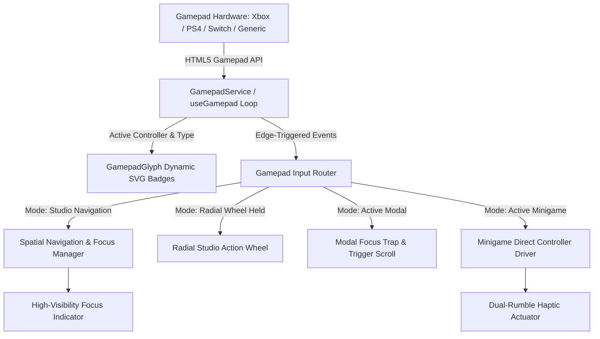

# Gamepad Controller Support, Dynamic UI Navigation & Pad-Centric Studio Minigames

## 1. Problem Statement & Objectives
- **Current State**: The game is entirely mouse/touch driven. While keyboard shortcuts exist for some dialogs, there is zero Gamepad API integration. Players using Xbox, PlayStation, Switch, or Steam Deck controllers cannot navigate menus, manage studio rooms, or play minigames natively.
- **Objectives**:
  1. **Cross-Platform Gamepad Engine**: Support Xbox (One/Series), PlayStation (DualShock 4/DualSense), Nintendo Switch (Pro/Joy-Con), and generic gamepads via the Standard Gamepad API with analog deadzones, edge-triggered inputs, and haptic vibration feedback.
  2. **Dynamic & Agnostic Button Glyphs**: Authentic vector SVG badges (Xbox A/B/X/Y, PS4/PS5 ✕/○/□/△, Switch B/A/Y/X, and Agnostic South/East/West/North) that auto-detect the connected controller with manual overrides in Settings.
  3. **Console-Grade UI Navigation**: Snappy spatial grid navigation across the studio and menus, bumper tab cycling (`LB`/`RB` or `L1`/`R1`), trigger scrolling (`LT`/`RT`), and a quick **Radial Action Wheel** for instant studio tab jumping.
  4. **Pad-Centric Minigame Suite**: Three new high-engagement minigames built around controller mechanics:
     - **MPC Finger-Drumming / Beat Pad**: Face buttons & bumpers trigger drum hits to rhythm cue bars.
     - **Reel-to-Reel Tape Jog & Splice**: Dual thumbsticks scrub analog tape reels across playhead with variable-pitch audio; triggers set splice points; face button makes the razor cut.
     - **Dual-Stick Console Fader Ride & Stereo Pan**: Left stick rides vertical gain fader into target RMS zone; Right stick counter-balances drifting stereo field with clip vibration.

---

## 2. Core Architecture & Subsystems

### A. Gamepad Engine (`src/services/gamepadService.ts` & `src/hooks/useGamepad.ts`)
- **Polling Loop**: Executes on `requestAnimationFrame` polling `navigator.getGamepads()`.
- **Controller Detection Heuristics**:
  - `playstation`: `gamepad.id` contains `054c`, `dualshock`, `dualsense`, `wireless controller`, or `sony`.
  - `xbox`: `gamepad.id` contains `045e`, `xbox`, `x-box`, `xinput`.
  - `switch`: `gamepad.id` contains `057e`, `switch`, `pro controller`, `joy-con`.
  - `generic`: Default fallback.
- **Deadzones & Processing**:
  - Analog stick deadzone: `0.18` (prevents joystick drift while preserving fine analog feathering).
  - Triggers: normalized `0.0` to `1.0`.
  - Edge detection: Tracks previous frame vs current frame to provide clean `justPressed(button)` and `justReleased(button)` events.
- **Haptic Vibration**:
  - Wraps `gamepad.vibrationActuator.playEffect('dual-rumble', { startDelay, duration, weakMagnitude, strongMagnitude })` with fallback for browsers without haptic support.

### B. Dynamic Button Glyphs (`src/components/ui/GamepadGlyph.tsx`)
- Sharp, authentic inline vector SVGs matching the detected controller style:
  - **Xbox**: Green A, Red B, Blue X, Yellow Y, LB, RB, LT, RT, D-Pad, LS, RS, View/Menu.
  - **PlayStation**: Blue ✕, Red ○, Pink □, Green △, L1, R1, L2, R2, D-Pad, L3, R3, Share/Options.
  - **Nintendo Switch**: Cyan B, Red A, Green Y, Blue X, L, R, ZL, ZR, + / -.
  - **Agnostic**: Neutral dark pill with crisp white directional or standard abbreviations (South, East, West, North, L1, R1, L2, R2).
- **Auto-Switching Input Indicator**:
  - Listens for `keydown` / `mousemove` vs gamepad activity. When mouse moves, UI displays keyboard/mouse hints; as soon as any pad button or stick moves, UI transitions seamlessly to controller glyphs.

---

## 3. Navigation & Gameplay Optimization

### A. Global Studio Navigation
- **Bumper Tab Cycling (`LB` / `RB` or `L1` / `R1`)**:
  - Cycles across command dock tabs: `Bookings` ↔ `Session` ↔ `Gear` ↔ `Crew` ↔ `Artists` ↔ `Charts` ↔ `Career`.
- **Global Face Button Shortcuts**:
  - `South` (`A` / `✕`): Activate focused element / primary card action.
  - `East` (`B` / `○`): Close open modal / return to studio room floor.
  - `West` (`X` / `□`): Contextual action (e.g., Quick Session Work / Record Take).
  - `North` (`Y` / `△`): Advance Day / Rest.
- **Trigger Scroll (`LT` / `RT` or `L2` / `R2`)**:
  - Smoothly scrolls active dialog lists (e.g. Gig bookings, Equipment shop catalog, Staff candidates).
- **Spatial Focus Trapping**:
  - D-pad and Left stick hop focus across elements with `.gamepad-focusable`.
  - High-visibility focus ring: `ring-2 ring-amber-400 ring-offset-2 ring-offset-slate-950 shadow-[0_0_12px_rgba(251,191,36,0.6)]`.

### B. Contextual Radial Action Wheel (`src/components/ui/RadialActionWheel.tsx`)
- Triggered by holding `LT` (Left Trigger) or pressing `R3` (Right Stick Click) in the studio.
- Overlays an analog 8-way studio wheel:
  - North: Bookings
  - North-East: Session / Record Take
  - East: Studio Gear Rack
  - South-East: Artists & Bands
  - South: Staff & Crew
  - South-West: Charts & Milestones
  - West: Producer Career & Perks
  - North-West: Studio Settings
- Releasing the trigger or stick snaps directly into the selected panel with a crisp tactile haptic pulse.

---

## 4. Pad-Centric Minigames Specification

### 1. MPC Beat Pad (`BeatPadGame.tsx`)
- **Concept**: 4-pad Akai-style tactile drum sampler.
- **Controls**:
  - `A` / `✕` (South) = Kick Drum
  - `X` / `□` (West) = Snare Drum
  - `Y` / `△` (North) = Closed Hi-Hat
  - `B` / `○` (East) = Perc Clap / Open Hat
  - `LB` / `RB` = Rapid 16th roll / accent hit
- **Gameplay**:
  - Rhythmic cues scroll down 4 colored lanes toward target strike line.
  - Hitting pads plays high-quality drum audio samples.
  - Accuracy scoring: Perfect (±25ms), Great (±50ms), Good (±90ms), Miss.
  - Controller haptic pulse on downbeats.
- **Rewards**: Large bonus to Project Creativity (+15 to +25) and Artist Chemistry.

### 2. Reel-to-Reel Tape Jog & Splice (`TapeJogGame.tsx`)
- **Concept**: Analog magnetic tape editing on a vintage 2-inch tape machine.
- **Controls**:
  - **Left & Right Sticks**: Analog scrub wheels to spin the tape spools backward and forward with dynamic tape scrub audio pitch modulation.
  - **Triggers (`LT` / `RT`)**: Mark splice In-Point and Out-Point around the noisy/bad take transient.
  - **`South` (`A` / `✕`)**: Execute razor cut and tape splice.
- **Gameplay**:
  - A moving tape strip passes over the magnetic playback head.
  - Player spots the transient spike (glitch or off-key note), scrubs precisely to the start and end of the artifact, marks In/Out, and presses slice.
  - Precision cuts get evaluated on alignment margin (within 2px = 100% Master Cut).
- **Rewards**: Large bonus to Technical Quality (+20) and +10% Studio Equipment Longevity.

### 3. Dual-Stick Fader Ride & Stereo Pan (`ConsoleRideGame.tsx`)
- **Concept**: Riding a physical console fader and stereo pan pot during a dynamic live vocal/instrument track.
- **Controls**:
  - **Left Stick (Vertical)**: Analog Motorized Level Fader (-∞ to +10dB).
  - **Right Stick (Horizontal)**: Analog Stereo Pan (Hard Left to Hard Right).
- **Gameplay**:
  - Performer's raw dynamic input signal fluctuates unpredictably with dynamic volume leaps and stereo drift.
  - Player must ride the Left Stick to maintain output in the golden zone (+0dB RMS to +2dB), preventing signal dropouts or harsh digital clipping (>+3.5dB).
  - Simultaneously, player uses Right Stick to counter-balance stereo drift back toward the center mix.
  - Haptic feedback pulses urgently when output level enters the red clipping zone.
- **Rewards**: High Production Value, Mix Balance rating, and Staff XP.

---

## 5. Beads Implementation Plan

To be tracked and managed via `bd`:
- **Epic**: `[epic] Gamepad Controller Support, Dynamic UI Navigation & Pad-Centric Minigames`
- **Subtask 1**: Gamepad Service, polling loop, controller auto-detection (Xbox, PS, Switch, Generic), and haptics actuator.
- **Subtask 2**: `GamepadGlyph` vector icon component and SettingsModal controller preference selector.
- **Subtask 3**: Spatial Navigation Provider, bumper dock tab cycling, trigger list scrolling, and focus ring system.
- **Subtask 4**: Radial Studio Action Wheel interface for quick thumbstick screen hopping.
- **Subtask 5**: MPC Beat Pad Minigame (`BeatPadGame`) implementation & audio wiring.
- **Subtask 6**: Reel-to-Reel Tape Jog & Splice Minigame (`TapeJogGame`) implementation & scrub audio.
- **Subtask 7**: Dual-Stick Console Fader Ride & Stereo Pan Minigame (`ConsoleRideGame`) with clipping haptics.
- **Subtask 8**: MinigameManager integration, auto-trigger weighting, and comprehensive testing checks.
