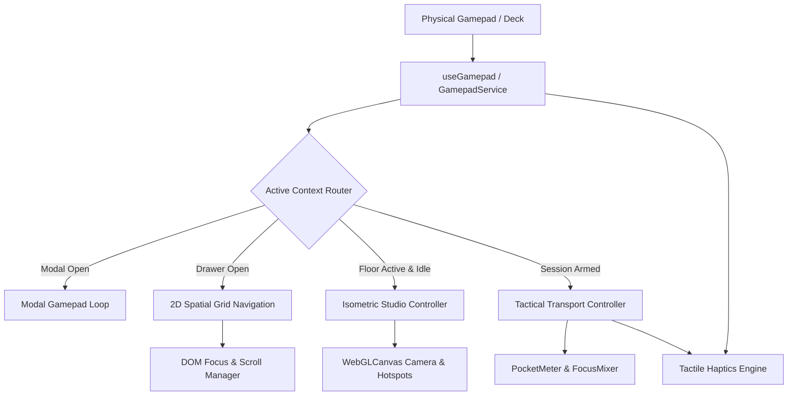

# Controller Gameplay Architecture & Design Specification

**Date:** 2026-10-04  
**Status:** Approved  
**Topic:** Controller & Gamepad Gameplay Overhaul  
**Target:** Recording Studio Tycoon (v1.5)

---

## 1. Overview & Objectives

Recording Studio Tycoon is an isometric management RPG featuring tactile studio sessions, active audio mixing, and drawer-based tycoon interfaces. While basic gamepad polling (`navigator.getGamepads()`) and linear tab cycling currently exist, playing on a gamepad or handheld device (e.g. Steam Deck) lacked arcade responsiveness, tactical transport feel, and spatial intuition.

This specification unifies controller interactions across three core pillars:
1. **Spatial Room & Camera Navigation:** Direct isometric hotspot vector targeting and Right Stick camera panning with zoom presets.
2. **Tactical Console Transport:** Analog trigger (`RT`) punch-in/lock take pedal, Left Stick pocket needle scrubbing, variable-rate fader tuning, and rich multi-frequency dual-rumble haptics.
3. **2D Spatial Grid Navigation:** Geometric cone raycasting across drawer cards, gigs, gear, and crew slots to replace linear DOM focus cycling.

---

## 2. Architecture & Subsystems

### 2.1 Gamepad Service & Hook Enhancements (`src/services/gamepadService.ts`, `src/hooks/useGamepad.ts`)
* **Analog Triggers:** Tracks normalized continuous values for `lt` (Left Trigger) and `rt` (Right Trigger) between `0.0` and `1.0`, with a calibrated digital actuation threshold at `0.4` and full lock threshold at `0.85`.
* **Multi-Pattern Haptic Dispatcher:**
  * `hapticTick()`: High-frequency notch pulse (`weak: 0.18, strong: 0.0, 25ms`).
  * `hapticDetent()`: Medium centering pulse (`weak: 0.25, strong: 0.15, 30ms`).
  * `hapticLockTake(quality)`:
    * Gold: Powerful resonant dual-strike (`weak: 0.7, strong: 0.95, 120ms`).
    * Silver/Solid: Crisp mechanical strike (`weak: 0.35, strong: 0.45, 60ms`).
    * Off-time: Double buzz alert (`weak: 0.4, strong: 0.2, 70ms x 2`).
  * `hapticMotorHum()`: Low-level continuous pulse (`weak: 0.05, strong: 0.02, 40ms`) for transport recording.

---

## 3. Pillar 1: Spatial Room & Camera Control

### 3.1 Right Stick Viewport Pan & R3 Zoom
* **Analog Camera Pan:** Right Stick (`axes[2]`, `axes[3]`) pans the Pixi isometric container smoothly with an exponential acceleration curve and deadzone (`0.18`).
* **Zoom Modes via R3 (Right Stick Click):**
  * Tapping R3 smoothly interpolates camera zoom between Overview (`1.0x`) and Workstation Focus (`1.6x`).
  * Double-clicking or holding R3 recenters the camera to world origin `(0, 0)`.
* **Disentangling Triggers:** Frees `RT` from camera zoom so it can function exclusively as the tactile transport action.

### 3.2 Directional Hotspot Raycasting (`src/utils/studioHotspots.ts`)
* Floor hotspots (`console`, `liveRoom`, `phone`, `clock`, `tv`, `shelf`, `promotion`) have fixed 2D normalized coordinates in isometric space.
* When moving Left Stick or D-Pad while the studio floor is active:
  1. Computes directional heading angle from the currently selected hotspot.
  2. Queries candidate hotspots within a ±60° angular cone along the heading.
  3. Selects candidate with the lowest weighted angular and Euclidean distance.
* Visual Feedback: Active hotspot displays an animated glowing ring and a prominent controller glyph (`A` / South).

---

## 4. Pillar 2: Tactical Studio & Console Transport

### 4.1 Analog Trigger Punch-In Pedal
* In `ActiveProject.tsx` and `PocketMeter.tsx`:
  * Squeezing `RT` past `0.4` when take state is `idle` triggers `handleArmTake()`.
  * Pulling `RT` past `0.8` (or pressing `South`) while armed locks the needle in `PocketMeter`.
  * Provides players with a rhythmic physical stompbox feel matching studio hardware punch-in pedals.
  * `LT` (Left Trigger): Quick-listen preview or focus reset.

### 4.2 Dynamic Fader Velocity & Needle Jogging
* **Focus Mixer Channels (`performance`, `soundCapture`, `layering`):**
  * Left Stick horizontal tilt applies variable rate:
    * Small deflection (`0.2 < |x| < 0.6`): Fine adjustments of `±1%` per step.
    * Large deflection (`|x| >= 0.6`): Coarse adjustments of `±5%` to `±10%` per step.
  * Haptic detent fires whenever the fader passes the `50%` center point or target sweet spot.
* **PocketMeter Needle Jog:**
  * Slight analog horizontal bias during sweep allows precision rhythm adjustment before locking.

---

## 5. Pillar 3: 2D Spatial Grid Navigation Engine

### 5.1 Pure Geometric Resolver (`src/utils/spatialNavigation.ts`)
* Implements `findNextSpatialFocus(activeEl: HTMLElement, direction: 'up' | 'down' | 'left' | 'right', container: HTMLElement): HTMLElement | null`.
* **Algorithm:**
  1. Collects all visible, interactable DOM elements (`button`, `[role="tab"]`, `[role="slider"]`, `[tabindex="0"]`, `input`, `a`).
  2. Computes bounding box center $(x_0, y_0)$ for the active element and $(x_i, y_i)$ for candidates.
  3. Filters candidates strictly in the target half-plane ($x_i > x_0$ for right, $y_i < y_0$ for up, etc.).
  4. Calculates angular deviation $\theta$ from the directional axis. Candidates with $|\theta| > 50^\circ$ are discarded.
  5. Computes cost metric: $\text{Score} = \text{EuclideanDistance} \times (1 + 1.8 \times \sin^2\theta)$.
  6. Returns element with minimum score.

### 5.2 Zoned Hierarchy Traversal (`src/contexts/GamepadNavContext.tsx`)
* **Layer Priority:**
  * Active Modal Dialogs > Contextual Activity Drawer > Bottom Dock Navigation Bar > Floor Hotspots.
* **Navigation Rules:**
  * `D-Pad` and `Left Stick`: Navigates within the current layer using 2D spatial raycasting.
  * `LB` / `RB`: Always cycles the main dock categories regardless of focus depth.
  * `East` (B button): Closes modal or drawer, restoring focus to the parent layer.
  * Right Stick Y / Triggers: Continuous smooth scrolling for scrollable lists and cards.

---

## 6. HUD & Visual Accessibility

* **`GamepadHUD.tsx` Overhaul:**
  * Automatically detects controller type (`xbox`, `playstation`, `switch`, `generic`).
  * Displays dynamic action labels:
    * Idle Floor: `D-pad: Move`, `A: Inspect`, `R3: Zoom`, `RT: Arm Take`.
    * Active Take Armed: `RT / A: Lock Take`, `LS: Jog Needle`, `B: Abort`.
    * Drawer Open: `D-pad: Select`, `A: Confirm`, `B: Close`, `LB/RB: Categories`.
* **Enhanced Focus Ring CSS:**
  * Subtle glowing amber border styling (`outline: 2px solid hsl(var(--primary))`, glowing box shadow) so the player never loses visual tracking of the focused element.

---

## 7. Testing & Quality Strategy

1. **Unit & Geometric Math Tests (`tests/spatial-navigation.check.ts`):**
   * Validates cone raycasting for 2-column, 3-column, and uneven grid configurations.
   * Verifies angular filtering and distance weighting.
   * Verifies fallback behavior when no element is found in the half-plane.
2. **Gamepad Service & Haptics Tests (`tests/gamepad-service.check.ts`):**
   * Validates analog trigger normalization and threshold actuation.
   * Validates multi-tier haptic pattern generation and fallbacks when haptics are unsupported.
3. **Studio Hotspot Directional Navigation Tests (`tests/studio-hotspot-nav.check.ts`):**
   * Tests 2D directional transitions between all studio hotspots (`console`, `liveRoom`, `phone`, `clock`, `tv`, `shelf`, `promotion`).
4. **End-to-End Regression Suite (`pnpm test`):**
   * Ensures all 10 automated check suites pass cleanly without regression.
