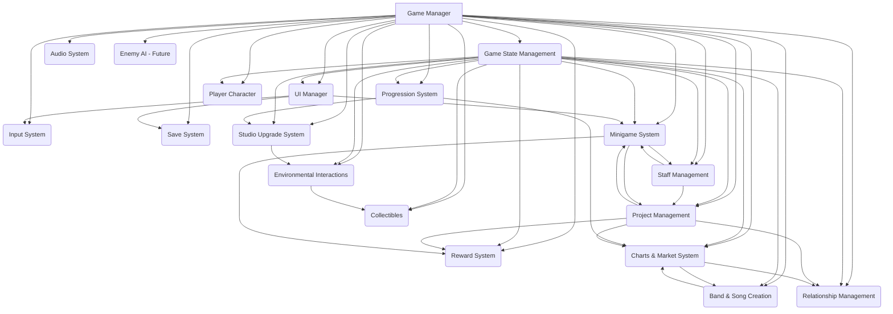
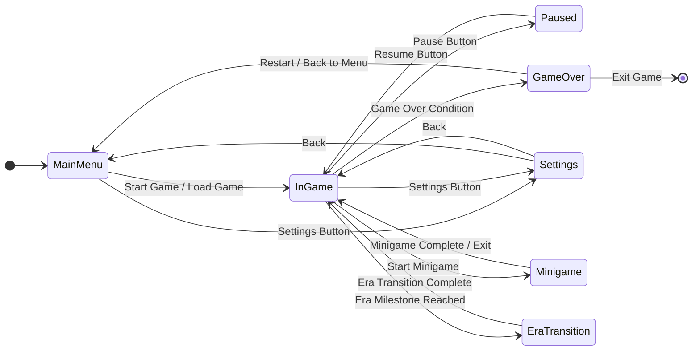

## Comprehensive Architectural Plan for Recording Studio Tycoon (Unity)

This document outlines the architectural design for the Unity version of Recording Studio Tycoon, integrating new features and adhering to best practices for scalability, maintainability, and performance.

### 1. Overall System Breakdown

The game will be structured around a set of interconnected, modular systems, each responsible for a specific domain of game logic or functionality.



**Major Game Systems:**

*   **Game State Management:** Centralized management of all dynamic game data (`GameState.cs`).
*   **Input System:** Handles player input (keyboard, mouse, touch, gamepad) and translates it into game actions.
*   **UI Manager:** Orchestrates the display and interaction of all UI elements, leveraging Unity's native UI systems (UGUI/UI Toolkit).
*   **Save System:** Manages persistence of game data (local and cloud).
*   **Audio System:** Controls all in-game sound effects and background music.
*   **Progression System:** Manages player XP, levels, skill development, era transitions, and content unlocks.
*   **Staff Management:** Handles hiring, training, assignment, and overall lifecycle of staff members.
*   **Project Management:** Oversees the creation, progress, and completion of music projects.
*   **Reward System:** Distributes in-game currency, XP, and items.
*   **Charts & Market System:** Simulates the music industry, including genre trends, song charts, and market events.
*   **Band & Song Creation:** Manages player-created bands, song development, and release.
*   **Minigame System:** Manages the execution and outcomes of various interactive minigames.
*   **Studio Upgrade System:** Manages studio expansion, perks, specializations, and prestige.
*   **Relationship Management:** Handles interactions with clients, record labels, and industry figures.
*   **Environmental Interactions:** Manages player interaction with studio objects (e.g., equipment, furniture).
*   **Player Character:** (If applicable, for 3D environments) Manages player movement, animation, and interaction.
*   **Enemy AI:** (Future) Manages behavior of rival studios or industry competitors.
*   **Collectibles:** (If applicable) Manages discovery and effects of collectible items.

### 2. Inter-System Communication

Communication between systems will primarily follow a decoupled, event-driven approach, with some direct references for core managers.

*   **C# Events (`System.Action`, `System.EventHandler`):** Preferred for one-to-many communication where systems need to react to changes without direct knowledge of the publisher.
    *   `GameManager.OnGameStateChanged`: A generic event triggered whenever the `GameState` is updated, allowing UI and other systems to react.
    *   `GameManager.OnPlayerLevelUp`: Specific event for player level-ups, carrying `LevelUpDetails`.
    *   Events for project completion, staff hired, equipment purchased, etc.
*   **Unity Events:** Useful for exposing events to the Unity Editor, allowing designers to hook up visual or audio responses directly. Less common for core logic communication.
*   **Direct References via Singleton:** For core managers that need to be globally accessible and provide central services.
    *   `GameManager.Instance`: Provides access to the `GameState` and core game actions.
    *   `UIManager.Instance`: Provides methods for displaying UI elements.
    *   `SaveSystem.Instance`: Handles saving and loading.
*   **ScriptableObjects:** Used for static data configuration and as a shared data source that systems can reference without direct dependencies on each other's runtime instances.
*   **Data Serialization/Deserialization:** When passing complex data structures between C# and ReactUnity, JSON serialization will be used. C# will serialize `GameState` objects or parts thereof into JSON strings, which ReactUnity will deserialize and use to render the UI. Conversely, ReactUnity will serialize user input or action parameters into JSON to be passed back to C# methods.

### 3. Game State Management (FSM)

A Finite State Machine (FSM) will manage the overall game flow, ensuring clear transitions and logic for different game contexts.



**States:**

*   **MainMenu:** Player is in the main menu, can start a new game, load a game, access settings, or view credits.
*   **InGame:** Core gameplay loop is active. Player can manage studio, projects, staff, interact with environment, etc.
*   **Paused:** Game is paused. Player can access settings, save, or quit. Game logic is suspended.
*   **Minigame:** A minigame is active. Game logic is focused on the minigame, and main UI might be hidden or overlaid.
*   **GameOver:** Game over condition met (e.g., bankruptcy, specific failure). Player can view results, restart, or return to main menu.
*   **EraTransition:** Special state for transitioning between game eras, potentially involving animations, summaries, and new content unlocks.
*   **Settings:** Player is adjusting game settings (audio, graphics, controls). Can be accessed from MainMenu or InGame.

**Transitions:**

Transitions will be triggered by player input (e.g., button clicks) or internal game logic conditions (e.g., `money <= 0` for `GameOver`, `playerLevel >= milestoneLevel` for `EraTransition`). The `GameManager` will be responsible for managing these state transitions, ensuring proper initialization and cleanup for each state.

### 4. Data Management Strategy

A hybrid approach will be used for managing game data, combining Unity's native features with external serialization.

*   **ScriptableObjects:** For static, immutable game data configured by designers.
    *   `ProgressionData.cs`: Player milestones, XP requirements, unlocked features.
    *   `ProjectData.cs`: Project templates, genre definitions, difficulty curves.
    *   `EquipmentData.cs`: All equipment properties, bonuses, icons.
    *   `StaffData.cs`: Staff roles, base stats, potential traits.
    *   `MinigameData.cs`: Minigame configurations, rewards, difficulty scaling.
    *   `EraData.cs`: Era-specific content, year ranges, unique events.
    *   `MarketTrendData.cs`: Predefined market trend patterns, sub-genre evolution rules.
    *   `StudioPerkData.cs`: Perk tree definitions, perk effects.
*   **`[System.Serializable]` Classes:** For dynamic, mutable game state data that needs to be saved and loaded.
    *   `GameState.cs` and all its nested classes (e.g., `PlayerData`, `Band`, `Project`, `StaffMember`).
    *   Custom `SerializableDictionary` implementations will be used to handle dictionaries within `GameState` for Unity's `JsonUtility` or a third-party serializer.
*   **JSON Serialization:** For saving and loading `GameState` to/from local files. `JsonUtility` can be used for simpler cases, but for complex nested structures and dictionaries, a more robust library like Newtonsoft.Json might be necessary.
*   **PlayerPrefs:** Only for very small, non-critical settings (e.g., volume, last played save slot). Not for core game state.
*   **Cloud Save (Supabase):** For advanced save features like cross-device sync, multiple save slots, versioning, auto-save, encryption, compression, incremental saves, export/import, analytics, conflict resolution, and backup. This will involve a dedicated `SaveSystem.cs` component that interacts with the Supabase API.

### 5. UI Architecture

A modular UI architecture using Unity's UI Canvas and ReactUnity will ensure responsiveness and maintainability.

```mermaid
graph TD
    UIM[UI Manager] --> Canvas[Main UI Canvas]
    Canvas --> MainMenuPanel[Main Menu Panel]
    Canvas --> HUDPanel[HUD Panel]
    Canvas --> PauseMenuPanel[Pause Menu Panel]
    Canvas --> GameOverPanel[Game Over Panel]
    Canvas --> ModalsContainer[Modals Container]
    Canvas --> NotificationsContainer[Notifications Container]
    Canvas --> MinigameOverlay[Minigame Overlay]

    UIM --> ReactRenderer[ReactUnity Renderer]
    ReactRenderer --> ReactApp[React Application (TSX Components)]

    ReactApp --> GameState[Game State (C#)]
    GameState -- Events --> ReactApp
    ReactApp -- Actions --> GameManager[Game Manager (C#)]

    subgraph ReactComponents
        MM[Main Menu Components]
        HUD[HUD Components]
        PM[Pause Menu Components]
        GO[Game Over Components]
        Modal[Generic Modal Components]
        Notif[Notification Components]
        MG[Minigame UI Components]
    end

    MainMenuPanel --> MM
    HUDPanel --> HUD
    PauseMenuPanel --> PM
    GameOverPanel --> GO
    ModalsContainer --> Modal
    NotificationsContainer --> Notif
    MinigameOverlay --> MG
```

*   **Unity UI Canvas:** A single main `Canvas` will host all UI elements. Different UI screens (panels) will be activated/deactivated as needed.
*   **ReactUnity Integration:** The `ReactRendererUGUI` GameObject will be placed on the Canvas, acting as the bridge for rendering React components.
*   **Modular Panels:** Each major UI screen (Main Menu, HUD, Pause Menu, Game Over) will be a distinct Unity UI Panel, managed by the `UIManager`.
*   **Modal and Notification Systems:** Dedicated containers for modals and notifications will ensure they overlay correctly and are easily managed.
*   **Responsive Design:**
    *   Unity's `Canvas Scaler` will be configured to scale with screen size, using a reference resolution.
    *   ReactUnity components will use flexible layouts (flexbox-like properties) and relative units to adapt to different screen aspect ratios.
    *   Anchors and pivots in Unity UI will be used effectively for responsive positioning.
*   **Data Flow:**
    *   C# `GameManager` will expose `GameState` and trigger events (`OnGameStateChanged`, `OnPlayerLevelUp`).
    *   ReactUnity components will subscribe to these events and receive serialized `GameState` data to update their display.
    *   User interactions in ReactUnity (e.g., button clicks) will trigger C# methods on `GameManager` to perform game actions.
*   **Code Organization (UI):**
    *   Unity C# scripts for UI management will reside in `Assets/Scripts/UI/`.
    *   React components will be in `RecordingStudioTycoon_UnityPoC/react-ui/src/components/` with subfolders for different UI sections (e.g., `menu/`, `hud/`, `modals/`).

### 6. Core Gameplay Elements

*   **Player Character Controller (if applicable for 3D):**
    *   **Movement:** Standard Unity `CharacterController` or `Rigidbody` for physics-based movement.
    *   **Animation:** Animator Controller to manage states (idle, walk, run, interact) triggered by input and game events.
    *   **Interaction:** Raycasting or trigger colliders for detecting interactive objects. A dedicated `PlayerInteraction.cs` script will handle interaction logic.
*   **Enemy AI (Future):**
    *   **Pathfinding:** Unity's NavMesh system for navigation within the studio environment.
    *   **Behavior Trees/State Machines:** For defining complex AI behaviors (e.g., rival studio actions, staff AI for autonomous tasks).
    *   **Attack Patterns (if applicable):** ScriptableObjects to define different attack types and their properties.
*   **Collectible Items:**
    *   Each collectible will be a `Prefab` with a `Collectible.cs` script.
    *   `Collectible.cs` will define its type, value, and interaction logic (e.g., `OnTriggerEnter` to add to inventory, play sound, destroy object).
    *   A `CollectibleManager.cs` will handle spawning, tracking, and persistence of collectibles.
*   **Interactive Environmental Objects:**
    *   Each interactive object (e.g., equipment, furniture, doors) will be a `Prefab` with an `Interactable.cs` script.
    *   `Interactable.cs` will define the type of interaction (e.g., `UseEquipment`, `OpenDoor`, `UpgradeStudio`) and trigger relevant `GameManager` methods or UI events.
    *   Visual feedback (e.g., highlight on hover, animation on interaction) will be implemented.

### 7. Code Organization and Best Practices

**Unity Project Directory Structure:**

```
RecordingStudioTycoon_UnityPoC/
├── Assets/
│   ├── Scenes/                 // Game scenes (e.g., MainMenu, Studio, Minigame)
│   ├── Scripts/
│   │   ├── Core/               // GameManager, GameState, SaveSystem, UIManager
│   │   ├── Systems/            // Progression, Staff, Project, Charts, Band, Minigame, StudioUpgrade, Relationship
│   │   ├── UI/                 // C# scripts for UI management, ReactUnity bindings
│   │   ├── Gameplay/           // Player, Enemy, Collectibles, Interactables
│   │   ├── Utils/              // Static helper classes (ProgressionUtils, ProjectUtils, StaffUtils, BandUtils)
│   │   └── DataModels/         // C# classes for serializable data (e.g., Project, StaffMember, Band)
│   ├── ScriptableObjects/      // All ScriptableObject assets (ProgressionData, ProjectData, etc.)
│   ├── Prefabs/                // Reusable game objects (equipment, staff models, UI elements)
│   ├── Materials/              // PBR materials, UI materials
│   ├── Textures/               // Image assets
│   ├── Audio/                  // Sound effects, background music
│   ├── Animations/             // Animator Controllers, Animation Clips
│   ├── Shaders/                // Custom shaders
│   ├── ThirdParty/             // Imported assets/packages not from Package Manager
│   └── Resources/              // Assets loaded via Resources.Load (use sparingly)
├── Packages/                   // Unity Package Manager dependencies (ReactUnity, QuickJS)
├── ProjectSettings/
├── react-ui/                   // Root of the ReactUnity application (TSX source, build output)
│   ├── src/
│   │   ├── components/         // React components (e.g., menu, hud, modals)
│   │   ├── contexts/           // React Contexts
│   │   ├── hooks/              // React Hooks
│   │   ├── utils/              // React-specific utilities
│   │   └── index.tsx           // React app entry point
│   ├── public/                 // Static assets for React app
│   ├── build/                  // Compiled React app output
│   └── package.json
└── ... (other project files)
```

**C# Best Practices:**

*   **Namespace Usage:** Use clear namespaces (e.g., `RecordingStudioTycoon.Core`, `RecordingStudioTycoon.Systems.Staff`) to prevent naming conflicts and improve code organization.
*   **Encapsulation:** Use private fields with public properties (`public GameState GameState => _gameState;`) for controlled access to data.
*   **Single Responsibility Principle (SRP):** Each class and method should have one clear responsibility.
*   **Dependency Injection:** Where appropriate, inject dependencies (e.g., ScriptableObjects) via `[SerializeField]` in the Inspector or through constructors/methods, rather than relying heavily on global static access (except for core Singletons like `GameManager`).
*   **Event-Driven Design:** Favor C# events for communication between loosely coupled systems.
*   **Error Handling:** Implement robust error handling and logging using `Debug.LogError`, `try-catch` blocks, and custom exceptions.
*   **Code Comments and Documentation:** Provide clear comments for complex logic, public APIs, and design decisions.
*   **Consistent Naming Conventions:** Adhere to C# naming conventions (PascalCase for classes/methods/properties, camelCase for private fields).
*   **Performance Considerations:** Be mindful of `Update()` loop performance, object pooling for frequently instantiated objects, and efficient data structures.

**Design Patterns:**

*   **Singleton:** `GameManager`, `UIManager`, `SaveSystem` for global access to core services.
*   **Observer Pattern:** Implemented via C# events for decoupled communication (e.g., UI observing `GameState` changes).
*   **State Pattern (FSM):** For managing overall game flow (`GameManager` handling `GameState` transitions).
*   **Factory Pattern:** For creating instances of game entities (e.g., `ProjectFactory`, `StaffFactory` to generate new projects or staff candidates).
*   **Strategy Pattern:** For implementing different minigame mechanics or project outcome calculations.
*   **ScriptableObject Pattern:** For data-driven design, separating data from logic.

### 8. Simplification and Optimization

*   **Prefab Management:**
    *   Utilize Prefabs extensively for all reusable game objects (equipment, staff models, UI elements, collectibles).
    *   Use Prefab Variants for variations of common objects (e.g., different tiers of microphones).
    *   Employ object pooling for frequently instantiated and destroyed objects (e.g., floating reward orbs, particle effects) to reduce garbage collection overhead.
*   **Scene Optimization:**
    *   **Scene Splitting:** Consider splitting large scenes into smaller, additive scenes (e.g., separate scenes for Main Menu, Studio Interior, Minigame instances) to reduce load times and memory footprint.
    *   **Occlusion Culling:** For 3D environments, use Unity's occlusion culling to prevent rendering of hidden objects.
    *   **Static Batching/Dynamic Batching:** Optimize draw calls by marking static objects as static and ensuring materials/shaders allow for dynamic batching.
    *   **LOD (Level of Detail):** For complex 3D models, use LOD groups to render simpler versions at a distance.
*   **Data-Driven Design:** Moving static data to ScriptableObjects simplifies code, allows for easier balancing by designers, and reduces recompilation times.
*   **Event-Driven Architecture:** Reduces tight coupling, making systems more independent and easier to optimize or replace.
*   **Efficient Data Structures:** Use appropriate C# collections (e.g., `List`, `Dictionary`) for optimal performance based on access patterns. For dictionaries that need Unity serialization, implement custom `SerializableDictionary` wrappers.
*   **ReactUnity Performance:**
    *   Leverage React's `memo`, `useCallback`, `useMemo` hooks to prevent unnecessary re-renders of UI components.
    *   Profile ReactUnity UI rendering within Unity to identify and address bottlenecks.
    *   Ensure efficient data transfer between C# and ReactUnity, avoiding large, frequent data serialization.